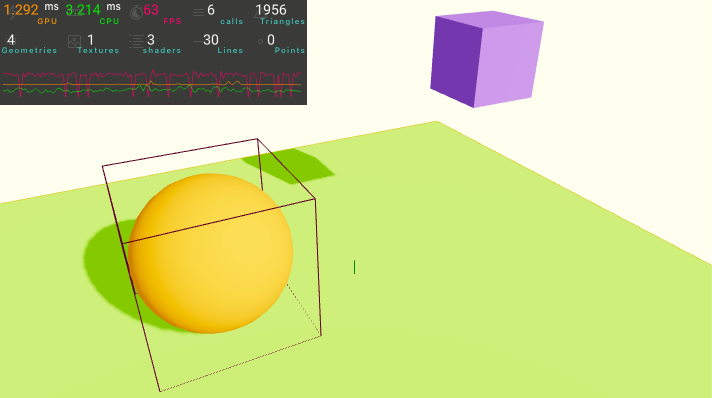
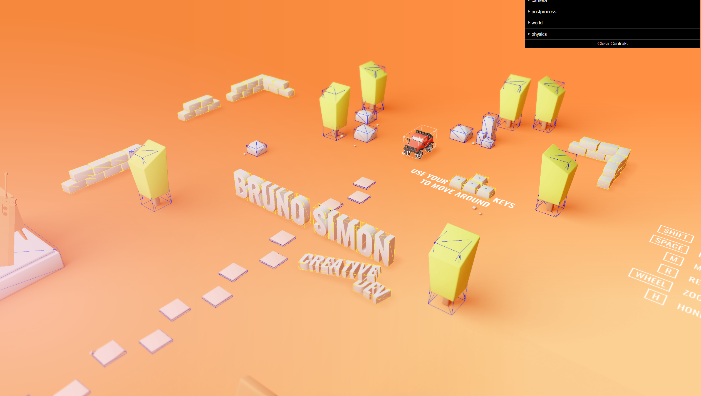
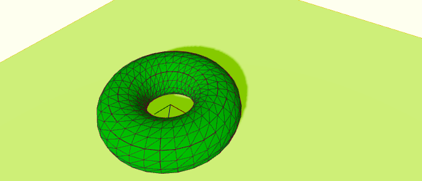
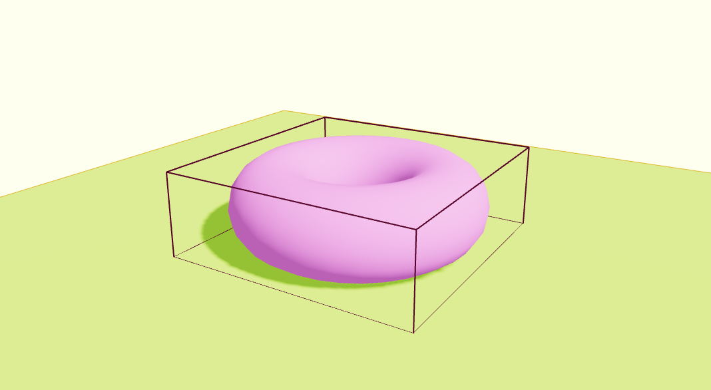
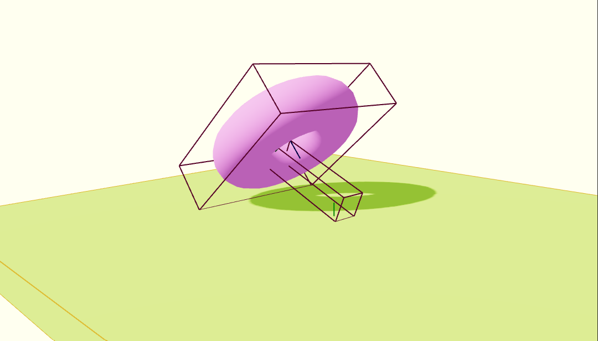
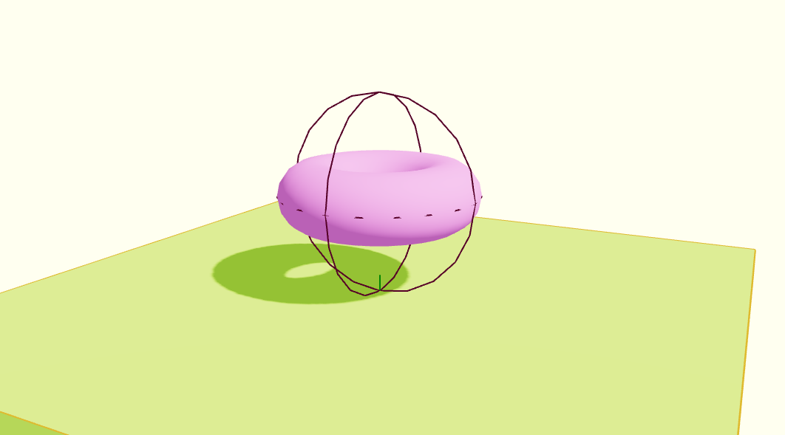

# Working Physics with Rapier in R3F

## 0. Links

### 0-0. Rapier
- [Official Website](https://rapier.rs/)
- [Getting Started](https://rapier.rs/docs/user_guides/javascript/getting_started_js/)
- [2D Example](https://rapier.rs/demos2d/index.html)
- [3D Example](https://rapier.rs/demos3d/index.html)
- [Colliders Overview](https://rapier.rs/docs/user_guides/bevy_plugin/colliders/#overview)
- [Joints](https://rapier.rs/docs/user_guides/javascript/joints/)

### 0-1. Rapier Documentation
- [@dimforge/rapier3d](https://rapier.rs/javascript3d/index.html)
- [@dimforge/rapier3d/RigidBody](https://rapier.rs/javascript3d/classes/RigidBody.html)
- [@dimforge/rapier3d/Ball](https://rapier.rs/javascript3d/classes/Ball.html)
- [@dimforge/rapier3d/Cuboid](https://rapier.rs/javascript3d/classes/Cuboid.html)
- [@dimforge/rapier3d/RoundCuboid](https://rapier.rs/javascript3d/classes/RoundCuboid.html)
- [@dimforge/rapier3d/Capsule](https://rapier.rs/javascript3d/classes/Capsule.html)
- [@dimforge/rapier3d/Cone](https://rapier.rs/javascript3d/classes/Cone.html)
- [@dimforge/rapier3d/Cylinder](https://rapier.rs/javascript3d/classes/Cylinder.html)
- [@dimforge/rapier3d/ConvexPolyhedron](https://rapier.rs/javascript3d/classes/ConvexPolyhedron.html)
- [@dimforge/rapier3d/TriMesh](https://rapier.rs/javascript3d/classes/TriMesh.html)
- [@dimforge/rapier3dHeightfield](https://rapier.rs/javascript3d/classes/Heightfield.html)


### 0-2. React Three Rapier
- [Github](https://github.com/pmndrs/react-three-rapier)
- [Github README](https://github.com/pmndrs/react-three-rapier#readme)
- [R3F Examples](https://docs.pmnd.rs/react-three-fiber/getting-started/examples)
(Search physics examples by typing *"rapier"*)

### 0-3. Three.js Documentation
- [Clock](https://threejs.org/docs/#api/en/core/Clock)
- [InstancedMesh](https://threejs.org/docs/#api/en/objects/InstancedMesh)
- [Matrix4](https://threejs.org/docs/?q=matrix#api/en/math/Matrix4)
- [Vector3](https://threejs.org/docs/?q=vector#api/en/math/Vector3)
- [Quaternion](https://threejs.org/docs/?q=quaternion#api/en/math/Quaternion)
- [Euler](https://threejs.org/docs/?q=euler#api/en/math/Euler)

### 0-4. Reference
- [Bruno Simon Portfolio](https://bruno-simon.com/#debug)

## 1. Set up

### 1-0. Installation
```
npm install @react-three/rapier@1.1
```

### 1-1. Import <Physics>
You need to wrap all meshes with <Physics> tag.
```
import { Physics } from "@react-three/rapier";

....

<Physics>
    <mesh .... />

    ....

</Physics>
```

### 1-2. Import `<RigidBody>`
You need to wrap meshes individually with `<RigidBody>` tag.
```
import { RigidBody, Physics } from "@react-three/rapier";

....

<Physics>
    <RigidBody>
        <mesh .... />
    </RigidBody>

    ....

</Physics>
```

### 1-3. Turn a floor "fixed"
Add **"fixed"** to "type" attibute. (Default type is **"dynamic"**).
```
<Physics>
    <RigidBody>
        <mesh .... />
    </RigidBody>

    ....

    <RigidBody type="fixed">
        <mesh .... />
    </RigidBody>
</Physics>
```

### 1-4. Debugging
<br>
Add **"debug"** attribute to `<Physics>` tag. <br>
Becareful, debug wireframes have an impact on performance.
```
<Physics debug>
    <RigidBody>
        <mesh .... />
    </RigidBody>

    ....

    <RigidBody type="fixed">
        <mesh .... />
    </RigidBody>
</Physics>
```

## 2. Collider


### 2-0. Cuboid collider
<br>
Cuboid collider is a default collider and it's automatically applied to a mesh. <br>
And if you include multiple meshes in one `<RigidBody>` tag, it behaves as one connected cuboid collider body.
```
<Physics debug>
    <RigidBody>
        <mesh .... />
        <mesh .... />
        <mesh .... />
    </RigidBody>

    ....

    <RigidBody type="fixed">
        <mesh .... />
    </RigidBody>
</Physics>
```

### 2-1. Performance-wise, default cuboid is great
Check Bruno Simon's portfolio....


### 2-2. Ball collider
<br>
Set "colliders" attibute of `<RigidBody>` to **"ball"**.
```
<RigidBody colliders="ball">
    <mesh .... />
</RigidBody>
```

### 2-3. Hull collider
<br>
Set "colliders" attibute of `<RigidBody>` to **"hull"**. <br>
It's like putting an elastic membrane around the object.
```
<RigidBody colliders="hull">
    <mesh .... />
</RigidBody>
```

### 2-4. Trimesh collider
<br>
Set "colliders" attibute of `<RigidBody>` to **"trimesh"**. <br>
You should avoid using trimesh with dynamic **RigidBodies** (dynamic objects are the ones falling like the sphere and the torus). The reason is that colliders generated with a trimesh are empty on the inside and it makes collision detection more complicated and prone to bugs. A fast object might get through the trimesh or end up stuck on its surface. This doesn’t mean that you can’t use it, but, preferably, you should use it on fixed RigidBodies. Otherwise, you should expect some bugs.
```
<RigidBody colliders="trimesh">
    <mesh .... />
</RigidBody>
```

### 2-5. Custom collider
First, we need to tell React Three Rapier not to generate the automatic collider by setting the "colliders" attribute to **"false"**. <br><br>
```
<RigidBody colliders={false}>
    <mesh .... />
</RigidBody>
```

#### 2-5-1. Rapier collider documentation
Since React Three Rapier implements Rapier's colliders, we can use the Rapier documentation as a reference (Check the "Constructors" part). <br>

- [BallCollider](https://rapier.rs/javascript3d/classes/Ball.html)
- [CuboidCollider](https://rapier.rs/javascript3d/classes/Cuboid.html)
- [RoundCuboidCollider](https://rapier.rs/javascript3d/classes/RoundCuboid.html)
- [CapsuleCollider](https://rapier.rs/javascript3d/classes/Capsule.html)
- [ConeCollider](https://rapier.rs/javascript3d/classes/Cone.html)
- [CylinderCollider](https://rapier.rs/javascript3d/classes/Cylinder.html)
- [ConvexHullCollider](https://rapier.rs/javascript3d/classes/ConvexPolyhedron.html)
- [TrimeshCollider](https://rapier.rs/javascript3d/classes/TriMesh.html)
- [HeightfieldCollider](https://rapier.rs/javascript3d/classes/Heightfield.html)

#### 2-5-2. CuboidCollider
<br>
If you want to put mesh inside CuboidCollider, then put `<mesh>` and `<CuboidCollider>` at the center and add move `<RigidBody>` by adding **"position"** and **"rotation"** attributes to it. <br>
Be aware, **"scale"** is not suppported by `<RigidBody>`!
```
import { CuboidCollider, .... } from "@react-three/rapier";

....

<RigidBody colliders={false} position={[0, 1, 0]} rotation={[Math.PI * 0.5, 0, 0]}>
    <CuboidCollider args={[1.5, 1.5, 0.5]} />

    <mesh castShadow>
        <torusGeometry args={[1, 0.5, 16, 32]} />
        <meshStandardMaterial color="violet" />
    </mesh>
</RigidBody>
```

#### 2-5-3. Multiple colliders
<br>
You can create multiple colliders inside one `<RigidBody>`. <br>
To adjust each collider, you can do by adding **"position"** and **"rotation"** attributes. respectively.
```
<RigidBody
  colliders={false}
  position={[0, 1, 0]}
  rotation={[Math.PI * 0.5, 0, 0]}
>
    <CuboidCollider args={[1.5, 1.5, 0.5]} />

    <CuboidCollider
      args={[0.25, 1, 0.25]}
      position={[0, 0, 1]}
      rotation={[-Math.PI * 0.35, 0, 0]}
    />

    <mesh castShadow>
        <torusGeometry args={[1, 0.5, 16, 32]} />
        <meshStandardMaterial color="violet" />
    </mesh>
</RigidBody>
```

#### 2-5-4. BallCollider
<br>
```
import { BallCollider, .... } from "@react-three/rapier";

....

<RigidBody colliders={false} position={[0, 1, 0]} rotation={[Math.PI * 0.5, 0, 0]}>
    <BallCollider args={[1.5]} />

    <mesh castShadow>
        <torusGeometry args={[1, 0.5, 16, 32]} />
        <meshStandardMaterial color="violet" />
    </mesh>
</RigidBody>
```


