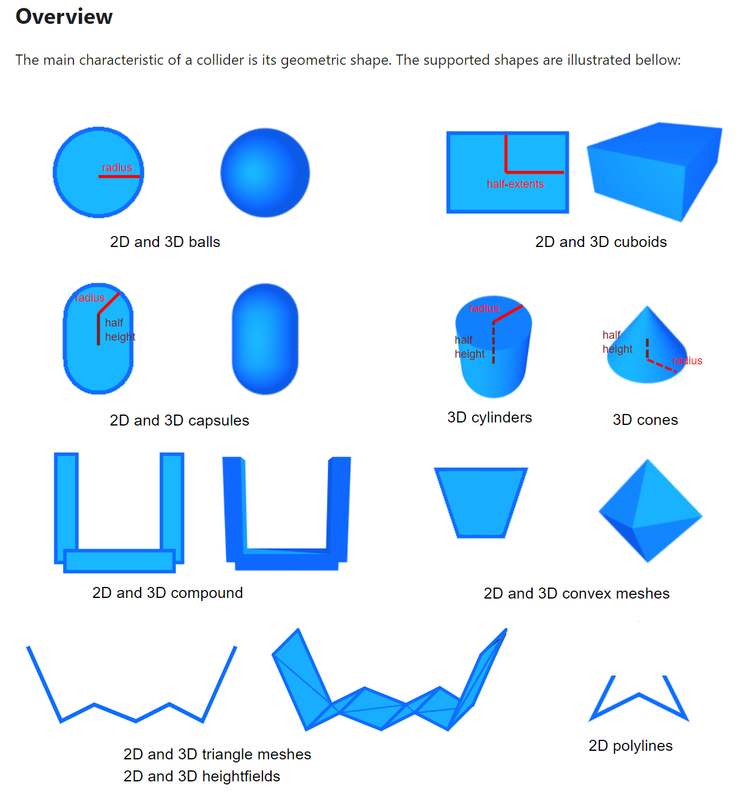
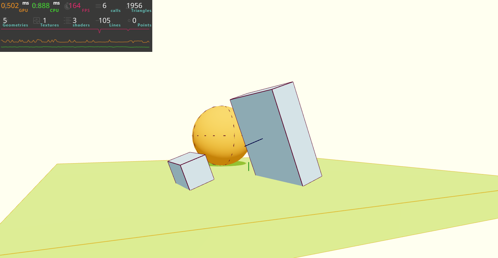
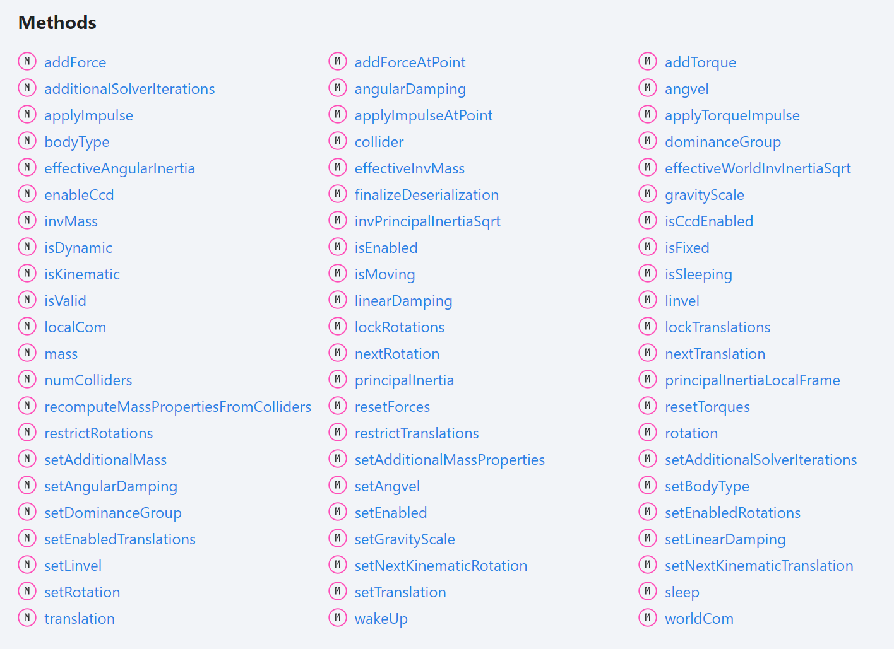
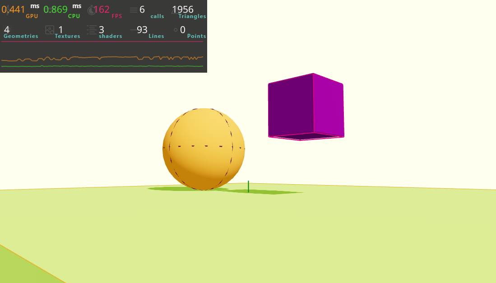
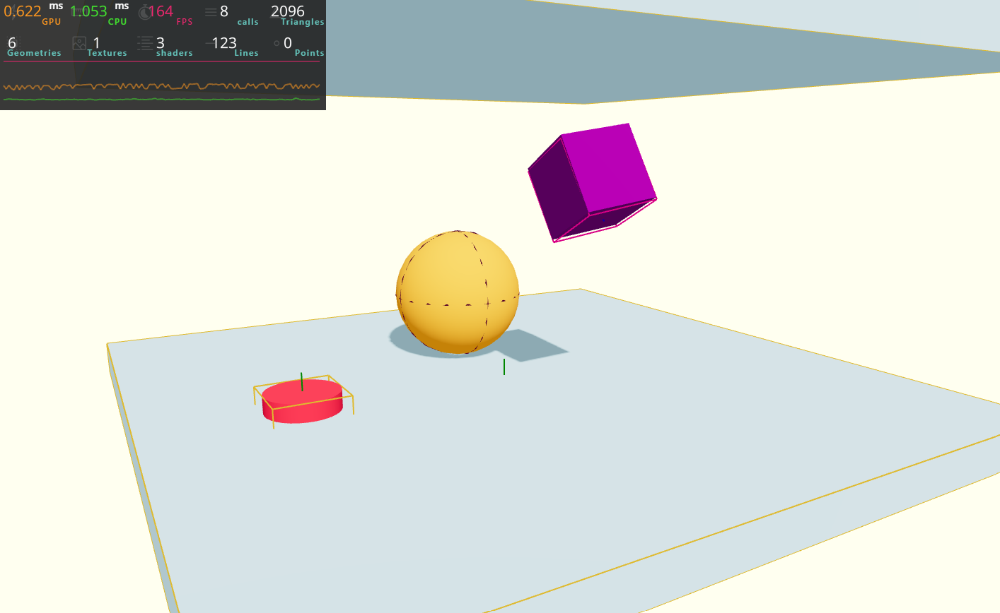
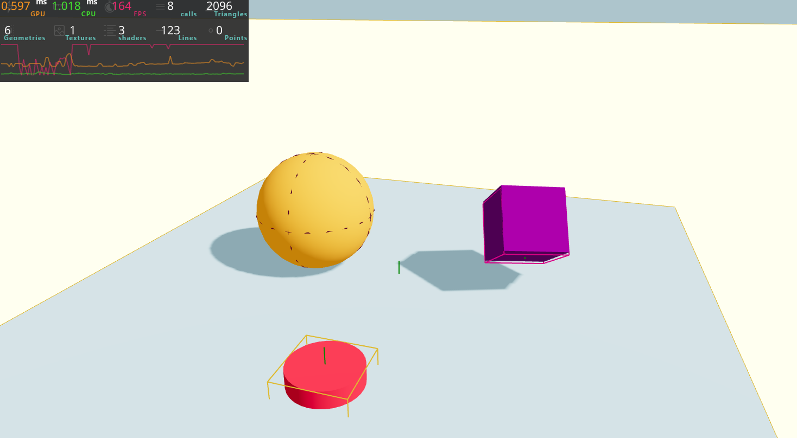

# Working Physics with Rapier in R3F

## 0. Links

### 0-0. Rapier
- [Official Website](https://rapier.rs/)
- [Getting Started](https://rapier.rs/docs/user_guides/javascript/getting_started_js/)
- [2D Example](https://rapier.rs/demos2d/index.html)
- [3D Example](https://rapier.rs/demos3d/index.html)
- [Colliders Overview](https://rapier.rs/docs/user_guides/bevy_plugin/colliders/#overview)
- [Joints](https://rapier.rs/docs/user_guides/javascript/joints/)

### 0-1. Rapier Documentation
- [@dimforge/rapier3d](https://rapier.rs/javascript3d/index.html)
- [@dimforge/rapier3d/RigidBody](https://rapier.rs/javascript3d/classes/RigidBody.html)
- [@dimforge/rapier3d/Ball](https://rapier.rs/javascript3d/classes/Ball.html)
- [@dimforge/rapier3d/Cuboid](https://rapier.rs/javascript3d/classes/Cuboid.html)
- [@dimforge/rapier3d/RoundCuboid](https://rapier.rs/javascript3d/classes/RoundCuboid.html)
- [@dimforge/rapier3d/Capsule](https://rapier.rs/javascript3d/classes/Capsule.html)
- [@dimforge/rapier3d/Cone](https://rapier.rs/javascript3d/classes/Cone.html)
- [@dimforge/rapier3d/Cylinder](https://rapier.rs/javascript3d/classes/Cylinder.html)
- [@dimforge/rapier3d/ConvexPolyhedron](https://rapier.rs/javascript3d/classes/ConvexPolyhedron.html)
- [@dimforge/rapier3d/TriMesh](https://rapier.rs/javascript3d/classes/TriMesh.html)
- [@dimforge/rapier3dHeightfield](https://rapier.rs/javascript3d/classes/Heightfield.html)


### 0-2. React Three Rapier
- [Github](https://github.com/pmndrs/react-three-rapier)
- [Github README](https://github.com/pmndrs/react-three-rapier#readme)
- [R3F Examples](https://docs.pmnd.rs/react-three-fiber/getting-started/examples)
(Search physics examples by typing *"rapier"*)

### 0-3. Three.js Documentation
- [Clock](https://threejs.org/docs/#api/en/core/Clock)
- [InstancedMesh](https://threejs.org/docs/#api/en/objects/InstancedMesh)
- [Matrix4](https://threejs.org/docs/?q=matrix#api/en/math/Matrix4)
- [Vector3](https://threejs.org/docs/?q=vector#api/en/math/Vector3)
- [Quaternion](https://threejs.org/docs/?q=quaternion#api/en/math/Quaternion)
- [Euler](https://threejs.org/docs/?q=euler#api/en/math/Euler)

#### 0-3-0. Geometries
- [BoxGeometry](https://threejs.org/docs/#api/en/geometries/BoxGeometry)
- [PlaneGeometry](https://threejs.org/docs/#api/en/geometries/PlaneGeometry)
- [SphereGeometry](https://threejs.org/docs/#api/en/geometries/SphereGeometry)
- [TorusGeometry](https://threejs.org/docs/#api/en/geometries/TorusGeometry)
- [TorusKnotGeometry](https://threejs.org/docs/#api/en/geometries/TorusKnotGeometry)

- [CapsuleGeometry](https://threejs.org/docs/#api/en/geometries/CapsuleGeometry)
- [CircleGeometry](https://threejs.org/docs/#api/en/geometries/CircleGeometry)
- [CylinderGeometry](https://threejs.org/docs/#api/en/geometries/CylinderGeometry)
- [DodecahedronGeometry](https://threejs.org/docs/#api/en/geometries/DodecahedronGeometry)
- [EdgesGeometry](https://threejs.org/docs/#api/en/geometries/EdgesGeometry)
- [ExtrudeGeometry](https://threejs.org/docs/#api/en/geometries/ExtrudeGeometry)
- [IcosahedronGeometry](https://threejs.org/docs/#api/en/geometries/IcosahedronGeometry)
- [LatheGeometry](https://threejs.org/docs/#api/en/geometries/LatheGeometry)
- [OctahedronGeometry](https://threejs.org/docs/#api/en/geometries/OctahedronGeometry)
- [PolyhedronGeometry](https://threejs.org/docs/#api/en/geometries/PolyhedronGeometry)
- [RingGeometry](https://threejs.org/docs/#api/en/geometries/RingGeometry)
- [ShapeGeometry](https://threejs.org/docs/#api/en/geometries/ShapeGeometry)
- [TetrahedronGeometry](https://threejs.org/docs/#api/en/geometries/TetrahedronGeometry)
- [TubeGeometry](https://threejs.org/docs/#api/en/geometries/TubeGeometry)
- [WireframeGeometry](https://threejs.org/docs/#api/en/geometries/WireframeGeometry)


### 0-4. Reference
- [Bruno Simon Portfolio](https://bruno-simon.com/#debug)

## 1. Set up

### 1-0. Installation
```
npm install @react-three/rapier@1.1
```

### 1-1. Import <Physics>
You need to wrap all meshes with <Physics> tag.
```
import { Physics } from "@react-three/rapier";

....

<Physics>
    <mesh .... />

    ....

</Physics>
```

### 1-2. Import `<RigidBody>`
You need to wrap meshes individually with `<RigidBody>` tag.
```
import { RigidBody, Physics } from "@react-three/rapier";

....

<Physics>
    <RigidBody>
        <mesh .... />
    </RigidBody>

    ....

</Physics>
```

### 1-3. Turn a floor "fixed"
Add **"fixed"** to "type" attibute. (Default type is **"dynamic"**).
```
<Physics>
    <RigidBody>
        <mesh .... />
    </RigidBody>

    ....

    <RigidBody type="fixed">
        <mesh .... />
    </RigidBody>
</Physics>
```

### 1-4. Debugging
<br>
Add **"debug"** attribute to `<Physics>` tag. <br>
Becareful, debug wireframes have an impact on performance.
```
<Physics debug>
    <RigidBody>
        <mesh .... />
    </RigidBody>

    ....

    <RigidBody type="fixed">
        <mesh .... />
    </RigidBody>
</Physics>
```

## 2. Collider


### 2-0. Cuboid collider
<br>
Cuboid collider is a default collider and it's automatically applied to a mesh. <br>
And if you include multiple meshes in one `<RigidBody>` tag, it behaves as one connected cuboid collider body.
```
<Physics debug>
    <RigidBody>
        <mesh .... />
        <mesh .... />
        <mesh .... />
    </RigidBody>

    ....

    <RigidBody type="fixed">
        <mesh .... />
    </RigidBody>
</Physics>
```

### 2-1. Performance-wise, default cuboid is great
Check Bruno Simon's portfolio....


### 2-2. Ball collider
<br>
Set "colliders" attibute of `<RigidBody>` to **"ball"**.
```
<RigidBody colliders="ball">
    <mesh .... />
</RigidBody>
```

### 2-3. Hull collider
<br>
Set "colliders" attibute of `<RigidBody>` to **"hull"**. <br>
It's like putting an elastic membrane around the object.
```
<RigidBody colliders="hull">
    <mesh .... />
</RigidBody>
```

### 2-4. Trimesh collider
<br>
Set "colliders" attibute of `<RigidBody>` to **"trimesh"**. <br>
You should avoid using trimesh with dynamic **RigidBodies** (dynamic objects are the ones falling like the sphere and the torus). The reason is that colliders generated with a trimesh are empty on the inside and it makes collision detection more complicated and prone to bugs. A fast object might get through the trimesh or end up stuck on its surface. This doesn’t mean that you can’t use it, but, preferably, you should use it on fixed RigidBodies. Otherwise, you should expect some bugs.
```
<RigidBody colliders="trimesh">
    <mesh .... />
</RigidBody>
```

### 2-5. Custom collider
First, we need to tell React Three Rapier not to generate the automatic collider by setting the "colliders" attribute to **"false"**. <br><br>
```
<RigidBody colliders={false}>
    <mesh .... />
</RigidBody>
```

#### 2-5-0. Rapier collider documentation
Since React Three Rapier implements Rapier's colliders, we can use the Rapier documentation as a reference (Check the "Constructors" part). <br>

- [BallCollider](https://rapier.rs/javascript3d/classes/Ball.html)
- [CuboidCollider](https://rapier.rs/javascript3d/classes/Cuboid.html)
- [RoundCuboidCollider](https://rapier.rs/javascript3d/classes/RoundCuboid.html)
- [CapsuleCollider](https://rapier.rs/javascript3d/classes/Capsule.html)
- [ConeCollider](https://rapier.rs/javascript3d/classes/Cone.html)
- [CylinderCollider](https://rapier.rs/javascript3d/classes/Cylinder.html)
- [ConvexHullCollider](https://rapier.rs/javascript3d/classes/ConvexPolyhedron.html)
- [TrimeshCollider](https://rapier.rs/javascript3d/classes/TriMesh.html)
- [HeightfieldCollider](https://rapier.rs/javascript3d/classes/Heightfield.html)

#### 2-5-1. CuboidCollider
<br>
If you want to put mesh inside CuboidCollider, then put `<mesh>` and `<CuboidCollider>` at the center and add move `<RigidBody>` by adding **"position"** and **"rotation"** attributes to it. <br>
Be aware, **"scale"** is not suppported by `<RigidBody>`!
```
import { CuboidCollider, .... } from "@react-three/rapier";

....

<RigidBody colliders={false} position={[0, 1, 0]} rotation={[Math.PI * 0.5, 0, 0]}>
    <CuboidCollider args={[1.5, 1.5, 0.5]} />

    <mesh castShadow>
        <torusGeometry args={[1, 0.5, 16, 32]} />
        <meshStandardMaterial color="violet" />
    </mesh>
</RigidBody>
```

#### 2-5-2. Multiple colliders
<br>
You can create multiple colliders inside one `<RigidBody>`. <br>
To adjust each collider, you can do by adding **"position"** and **"rotation"** attributes. respectively.
```
<RigidBody
  colliders={false}
  position={[0, 1, 0]}
  rotation={[Math.PI * 0.5, 0, 0]}
>
    <CuboidCollider args={[1.5, 1.5, 0.5]} />

    <CuboidCollider
      args={[0.25, 1, 0.25]}
      position={[0, 0, 1]}
      rotation={[-Math.PI * 0.35, 0, 0]}
    />

    <mesh castShadow>
        <torusGeometry args={[1, 0.5, 16, 32]} />
        <meshStandardMaterial color="violet" />
    </mesh>
</RigidBody>
```

#### 2-5-4. BallCollider
<br>
```
import { BallCollider, .... } from "@react-three/rapier";

....

<RigidBody colliders={false} position={[0, 1, 0]} rotation={[Math.PI * 0.5, 0, 0]}>
    <BallCollider args={[1.5]} />

    <mesh castShadow>
        <torusGeometry args={[1, 0.5, 16, 32]} />
        <meshStandardMaterial color="violet" />
    </mesh>
</RigidBody>
```

## 3. Access the body and apply forces

### 3-0. Create 'reference' for an object
Create ref of an object you want to apply forces and add it to `<RigidBody>` (not `<mesh>`!).
```
const cube = useRef();

....

<RigidBody ref={cube}>
    <mesh>
        <boxGeometry />
        <meshStandardMaterial />
    </mesh>
</RigidBody>
```

### 3-1. Create a handler for an action (jump)
Create a handler and add it to `<mesh>` though **'onClick'** attribute.
```
const handleCubeJump = () => {
    console.log("jump");
  };

....

<RigidBody ref={cube} onClick={handleCubeJump}>
    <mesh>
        <boxGeometry />
        <meshStandardMaterial />
    </mesh>
</RigidBody>
```

### 3-2. How to access the physical body?
Via reference, you can access 'Rapier' physical body (even the reference is link to `<mesh>`!). <br>
[@dimforge/rapier3d/RigidBody](https://rapier.rs/javascript3d/classes/RigidBody.html) <br>
<br>

### 3-3. 'addForce' vs 'applyImpulse'
`addForce` is used to apply a force that lasts for a quite long time (like the wind).<br><br>
`applyImpulse` is used to apply a short force for a very short period of time (like for a projectile).

### 3-4. Make a cube jump
<br>
`applyImpulse` needs a Vector 3 as a parameter (the direction of the impluse) and its length will be used as the strength. <br>
You don't need to create a Vector 3 class, just need to create an object with x, y, z properties.
```
const handleCubeJump = () => {
    cube.current.applyImpulse({ x: 0, y: 5, z: 0 });
  };
```

### 3-5. Rotation via 'addTorque' vs 'applyTorqueImpluse'
`addTorque` is equivalent of `addForce`. <br>
`applyTorqueImpluse` is equivalent of `applyImplulse`.

### 3-6. Make a cube rotate
<br> 
In order to rotate a cube, use `applyTorqueImpulse`. Be ware of a rotation axis.
```
const handleCubeJump = () => {
    cube.current.applyImpulse({ x: 0, y: 5, z: 0 }, true);

    cube.current.applyTorqueImpulse({ x: 0, y: 1, z: 0 }, true);
  };
```

### 3-7. Randomize cube rotation
```
const handleCubeJump = () => {
    cube.current.applyImpulse({ x: 0, y: 5, z: 0 }, true);
    
    cube.current.applyTorqueImpulse({
      x: Math.random() - 0.5,       // return -0.5 ~ 0.5
      y: Math.random() - 0.5,       // return -0.5 ~ 0.5
      z: Math.random() - 0.5,       // return -0.5 ~ 0.5
    }, true);
  };
```

## 4. Explore object setting for more fun physcis gimicks

### 4-0. What you can do?
You can control; <br>
<br>
- Gravity
- Restitution (the amount of respective kinetic energy lost in collision between two moving objects)
- Gravity
- Where objects are
- Where object are supposed to go
- And more ....

### 4-1. Gravity
The gravity is set to simulate earth gravity (near -9.81).<br>
You can play with **gravity** attribute of `<Physics>`.
```
<Physics debug gravity={[0, -1.6, 0]}>
    <RigidBody>
        <mesh .... />
    </RigidBody>

    ....
</Physics>
```

#### 4-1-0. Apply different gravity to each object
You can apply different gravity to each object respectively with **"gravityScale"** attribute of `<RigidBody>`.
```
<Physics debug gravity={[0, -9.81, 0]}>  // The world gravity

    <RigidBody gravityScale={1.7}>       // Individual gravity
        <mesh .... />
    </RigidBody>

    <RigidBody gravityScale={0.1}>       // Individual gravity
        <mesh .... />
    </RigidBody>

    ....
</Physics>
```

#### 4-1-1. Change the gravity at run time
<br> 
Toggle reverse & normal gravity with the botton. <br>
In addition, wake up target meshes at the same time.
```
const [reveseGravityParam, setReverseGravityParam] = useState(1);

const handleReverseGravity = () => {
    setReverseGravityParam(
      (prevReveseGravityParam) => prevReveseGravityParam * -1
    );

    sphere.current.wakeUp();
    cube.current.wakeUp();
    button.current.wakeUp();
  };

....

    <Physics debug gravity={[0, -9.81 * reveseGravityParam, 0]}>

        ....

        {/* REVERSE GRAVITY BUTTON */}
        <RigidBody ref={button} type="fixed">
          <mesh .... onClick={handleReverseGravity}>
            <cylinderGeometry />
            <meshStandardMaterial color="crimson" />
          </mesh>
        </RigidBody>

        ....
    </Physics>
```

### 4-2. Restitution
You can control the bounciness with `restitution` attribute. <br>
The default value is `0`, meaning that it doesn't bounce at all. <br>

#### 4-2-0. Apply restitution
<br> 
If you want to make an object bouncy, you should also consider its contact floor. If you don't set restitution of the floor, it means the object falls onto some solid material plane such as metal or concrete. So if you want to make the object falling in a good bouncy way, you should set the floor restitution. If you set both restitutions of the falling object and the contact floor to `1`, it bounces 100%.  
```
<RigidBody .... restitution={1}>     // A falling object  
    <mesh .... />
</RigidBody>

<RigidBody .... restitution={1}>     // A contacting floor
    <mesh .... />
</RigidBody>
```

#### 4-2-1. Change restitution rule
By default, Rapier will take an average of the two `restitution`. <br>
It's possible to change that rule, but it has to be done with the `Collider` itself, not the `RigidBody`. This means that first, you need to create `Collider` by yourself, and then import `CoefficientCombineRule` from Rapier and choose one of the rules provided in that object.

### 4-3. Friction
Friction lets us decide how much the surface are supposed to rub off on each other. You can control it with the `friction` attribute and the default value is `0.7`(`0` is no friction, like on the ice).

#### 4-3-0. Apply friction
<br> 
If you want to make an object slide on the floor, you should also make sure that its contact floor has the same low friction param. 
```
<RigidBody .... friction={0}>     // A sliding object  
    <mesh .... />
</RigidBody>

<RigidBody .... friction={0}>     // A contacting floor
    <mesh .... />
</RigidBody>
```

### 4-4. Mass
The mass of the `RigidBody` is automatically calculated as the sum of the masses of the `Colliders` that make up the `RigidBody`. The mass of the `Colliders` `is automatically calculated accordning to their shape and volume. <br>
In other words, big object will automatically have a bigger mass.<br><br>
The mass won't change how fast an object falls (which means all objects fall at the same speed if there's no air friction or other affecting stuff). However, the mass will influence the forces involved. If two objects collide while one has a huge mass and the other one has a small mass, the huge mass will push away the small mass. <br>

#### 4-4-0. Change mass of objects

In order to tweak objects' mass, you need to create `Collider` by yourself. <br>
`1` is default, and if you set the lower value like `0.5`, it behaves as if it's made of cardboard, and if you set the higher value like `2`, it does of metal. Thus, the mass affects behaviours when forces are applied.
```
<RigidBody .... colliders={false}>
    <CuboidCollider mass={0.5} args={[0.5, 0.5, 0.5]} />

    <mesh castShadow onClick={handleCubeJump}>
        <boxGeometry />
        <meshStandardMaterial color="purple" />
    </mesh>
</RigidBody>
```

#### 4-4-1. Change apply force / impluse flexibly depending on object mass

Since mass affects force appiled behaviours, maybe you need to take care the force strength. In that case, you can tweak like below to maintain the same behaviour regardless of mass. 
```
// Handler - cube jump
const handleCubeJump = () => {
const mass = cube.current.mass();       // Accessing the mass of object

cube.current.applyImpulse({ x: 0, y: 5 * mass, z: 0 }, true);   // Here's trick
cube.current.applyTorqueImpulse(
    {
    x: Math.random() - 0.5,
    y: Math.random() - 0.5,
    z: Math.random() - 0.5,
    },
    true
);
};

....

    <RigidBody .... colliders={false}>
        <CuboidCollider mass={2} args={[0.5, 0.5, 0.5]} />

        <mesh castShadow onClick={handleCubeJump}>
            <boxGeometry />
            <meshStandardMaterial color="purple" />
        </mesh>
    </RigidBody>

```

### 4-5. Position and rotation
We can change the position & rotatino of `<RigidBody>` through their `position` and `rotation` attributes. But for **"dynamic" and "fixed"** object, you SHOULD NOT CHANGE THOESE VALUES!! Thus, if you want to move an object, you should apply forces to it.<br><br>
If you really really need update the object position & rotation directly, there are below two options.

#### 4-5-0. If you need to move it just once
You can do it with the appropriate methods, but you'll have to reset velocities that are currently applied on it and also make sure to not move it inside another `RigidBody`.

#### 4-5-1. If you need to move it in time (like a carousel or moving obstacle)
You can use the `kinematic` types to make objects move & rotate and it's often used for character controllers and carousels. There's two types: `kinematicPosition` and `kinematicVelocity`.

#### 4-5-2. "kinematicPosition" vs "kinematicVelocity"
`kinematicPosition`: you provide the next position and it'll update the object velocity accordingly.<br>
`kinematicVelocity`: you provide the velocity directly.

#### 4-5-3. "kinematic" objects don't move by forces
Objects whose type are `kinematic` are not affected by forces and move. The only way to move them is using `kinematicPosition` or  `kinematicVelocity` to change their positions.

#### 4-5-4. "setNextKinematicTranslation" vs "setNextKinematicRotation"
`setNextKinematicTranslation` (Fn): move an object 
`setNextKinematicRotation` (Fn): rotate an object

#### 4-5-5. Rotate the twister 

The function `setNextKinematicRotation` is expecting a Quaternion and not a Euler. Quaternion are harder to express and you cannot write just one directly. Therefore, you need to take several steps properly. <br><br>

0. Set the object type to `kinematicPosition`
1. Create a Three.js **"Euler"**
2. Create a Three.js **"Quaternion"**
3. Send that **"Quaternion"** to `setNextKinematicRotation`

<br><br>

```
const twister = useRef();

....

// Rotate the twister with each frame
useFrame((state, delta) => {
    const time = state.clock.getElapsedTime();

    const eulerRotation = new THREE.Euler(0, time, 0);
    const quaternionRotation = new THREE.Quaternion();
    quaternionRotation.setFromEuler(eulerRotation);

    twister.current.setNextKinematicRotation(quaternionRotation);
});

....

    {/* TWISTER */}
    <RigidBody .... type="kinematicPosition">
        <mesh .... />
    </RigidBody>

```

#### 4-5-6. Move the twister position

```
const twister = useRef();

....

// Rotate & move the twister with each frame
useFrame((state, delta) => {
    // Fetch time
    const time = state.clock.getElapsedTime();

    // For rotating the twister
    const eulerRotation = new THREE.Euler(0, time, 0);
    const quaternionRotation = new THREE.Quaternion();
    quaternionRotation.setFromEuler(eulerRotation);

    twister.current.setNextKinematicRotation(quaternionRotation);

    // For moving positions of the twister
    const angle = time * 0.5;

    const x = Math.cos(angle) * 2;
    const z = Math.sin(angle) * 2;

    twister.current.setNextKinematicTranslation({x: x, y: -0.8, z: z})

});

....

    {/* TWISTER */}
    <RigidBody .... type="kinematicPosition">
        <mesh .... />
    </RigidBody>
```
