# Working Physics with Rapier in R3F

## WPR-0. Links

### WPR-0-0. Rapier

- [Official Website](https://rapier.rs/)
- [Getting Started](https://rapier.rs/docs/user_guides/javascript/getting_started_js/)
- [2D Example](https://rapier.rs/demos2d/index.html)
- [3D Example](https://rapier.rs/demos3d/index.html)
- [Colliders Overview](https://rapier.rs/docs/user_guides/bevy_plugin/colliders/#overview)
- [Joints](https://rapier.rs/docs/user_guides/javascript/joints/)

### WPR-0-1. Rapier Documentation

- [@dimforge/rapier3d](https://rapier.rs/javascript3d/index.html)
- [@dimforge/rapier3d/RigidBody](https://rapier.rs/javascript3d/classes/RigidBody.html)
- [@dimforge/rapier3d/Ball](https://rapier.rs/javascript3d/classes/Ball.html)
- [@dimforge/rapier3d/Cuboid](https://rapier.rs/javascript3d/classes/Cuboid.html)
- [@dimforge/rapier3d/RoundCuboid](https://rapier.rs/javascript3d/classes/RoundCuboid.html)
- [@dimforge/rapier3d/Capsule](https://rapier.rs/javascript3d/classes/Capsule.html)
- [@dimforge/rapier3d/Cone](https://rapier.rs/javascript3d/classes/Cone.html)
- [@dimforge/rapier3d/Cylinder](https://rapier.rs/javascript3d/classes/Cylinder.html)
- [@dimforge/rapier3d/ConvexPolyhedron](https://rapier.rs/javascript3d/classes/ConvexPolyhedron.html)
- [@dimforge/rapier3d/TriMesh](https://rapier.rs/javascript3d/classes/TriMesh.html)
- [@dimforge/rapier3dHeightfield](https://rapier.rs/javascript3d/classes/Heightfield.html)

### WPR-0-2. React Three Rapier

- [Github](https://github.com/pmndrs/react-three-rapier)
- [Github README](https://github.com/pmndrs/react-three-rapier#readme)
- [R3F Examples](https://docs.pmnd.rs/react-three-fiber/getting-started/examples)
  (Search physics examples by typing _"rapier"_)

### WPR-0-3. Three.js Documentation

- [Clock](https://threejs.org/docs/#api/en/core/Clock)
- [InstancedMesh](https://threejs.org/docs/#api/en/objects/InstancedMesh)
- [Matrix4](https://threejs.org/docs/?q=matrix#api/en/math/Matrix4)
- [Vector3](https://threejs.org/docs/?q=vector#api/en/math/Vector3)
- [Quaternion](https://threejs.org/docs/?q=quaternion#api/en/math/Quaternion)
- [Euler](https://threejs.org/docs/?q=euler#api/en/math/Euler)

#### WPR-0-3-0. Geometries

- [BoxGeometry](https://threejs.org/docs/#api/en/geometries/BoxGeometry)
- [PlaneGeometry](https://threejs.org/docs/#api/en/geometries/PlaneGeometry)
- [SphereGeometry](https://threejs.org/docs/#api/en/geometries/SphereGeometry)
- [TorusGeometry](https://threejs.org/docs/#api/en/geometries/TorusGeometry)
- [TorusKnotGeometry](https://threejs.org/docs/#api/en/geometries/TorusKnotGeometry)
- [CapsuleGeometry](https://threejs.org/docs/#api/en/geometries/CapsuleGeometry)
- [CircleGeometry](https://threejs.org/docs/#api/en/geometries/CircleGeometry)
- [CylinderGeometry](https://threejs.org/docs/#api/en/geometries/CylinderGeometry)
- [DodecahedronGeometry](https://threejs.org/docs/#api/en/geometries/DodecahedronGeometry)
- [EdgesGeometry](https://threejs.org/docs/#api/en/geometries/EdgesGeometry)
- [ExtrudeGeometry](https://threejs.org/docs/#api/en/geometries/ExtrudeGeometry)
- [IcosahedronGeometry](https://threejs.org/docs/#api/en/geometries/IcosahedronGeometry)
- [LatheGeometry](https://threejs.org/docs/#api/en/geometries/LatheGeometry)
- [OctahedronGeometry](https://threejs.org/docs/#api/en/geometries/OctahedronGeometry)
- [PolyhedronGeometry](https://threejs.org/docs/#api/en/geometries/PolyhedronGeometry)
- [RingGeometry](https://threejs.org/docs/#api/en/geometries/RingGeometry)
- [ShapeGeometry](https://threejs.org/docs/#api/en/geometries/ShapeGeometry)
- [TetrahedronGeometry](https://threejs.org/docs/#api/en/geometries/TetrahedronGeometry)
- [TubeGeometry](https://threejs.org/docs/#api/en/geometries/TubeGeometry)
- [WireframeGeometry](https://threejs.org/docs/#api/en/geometries/WireframeGeometry)

### WPR-0-4. Reference

- [Bruno Simon Portfolio](https://bruno-simon.com/#debug)

## WPR-1. Set up

### WPR-1-0. Installation

```
npm install @react-three/rapier@1.1
```

### WPR-1-1. Import <Physics>

You need to wrap all meshes with <Physics> tag.

```
import { Physics } from "@react-three/rapier";

....

<Physics>
    <mesh .... />

    ....

</Physics>
```

### WPR-1-2. Import `<RigidBody>`

You need to wrap meshes individually with `<RigidBody>` tag.

```
import { RigidBody, Physics } from "@react-three/rapier";

....

<Physics>
    <RigidBody>
        <mesh .... />
    </RigidBody>

    ....

</Physics>
```

#### WPR-1-2-0. `<RigidBody>` types

- `dynamic`: The body is affected by external forces and contacts. This is the default type of RigidBody.
- `fixed`: The body cannot move. It acts as if it has an infinite mass and will not be affected by any force. It will continue to collide with dynamic bodies but not with fixed nor with kinematic bodies. This is typically used for the ground or for temporarily freezing a body.
- `kinematicPosition`: The body position must not be altered by the physics engine. The user is free to set its next position and the body velocity will be deduced at each update accordingly to ensure a realistic behavior of dynamic bodies in contact with it. This is typically used for moving platforms, elevators, etc.
- `kinematicVelocity`: The body velocity must not be altered by the physics engine. The user is free to set its velocity and the next body position will be deduced at each update accordingly to ensure a realistic behavior of dynamic bodies in contact with it. This is typically used for moving platforms, elevators, etc.

### WPR-1-3. Turn a floor "fixed"

Add **"fixed"** to "type" attibute. (Default type is **"dynamic"**).

```
<Physics>
    <RigidBody>
        <mesh .... />
    </RigidBody>

    ....

    <RigidBody type="fixed">
        <mesh .... />
    </RigidBody>
</Physics>
```

### WPR-1-4. Debugging

<br>
Add **"debug"** attribute to `<Physics>` tag. <br>
Becareful, debug wireframes have an impact on performance.

```
<Physics debug>
    <RigidBody>
        <mesh .... />
    </RigidBody>

    ....

    <RigidBody type="fixed">
        <mesh .... />
    </RigidBody>
</Physics>
```

## WPR-2. Collider


### WPR-2-0. Cuboid collider

<br>
Cuboid collider is a default collider and it's automatically applied to a mesh. <br>
And if you include multiple meshes in one `<RigidBody>` tag, it behaves as one connected cuboid collider body.

```
<Physics debug>
    <RigidBody>
        <mesh .... />
        <mesh .... />
        <mesh .... />
    </RigidBody>

    ....

    <RigidBody type="fixed">
        <mesh .... />
    </RigidBody>
</Physics>
```

### WPR-2-1. Performance-wise, default cuboid is great

Check Bruno Simon's portfolio....


### WPR-2-2. Ball collider

<br>
Set "colliders" attibute of `<RigidBody>` to **"ball"**.

```
<RigidBody colliders="ball">
    <mesh .... />
</RigidBody>
```

### WPR-2-3. Hull collider

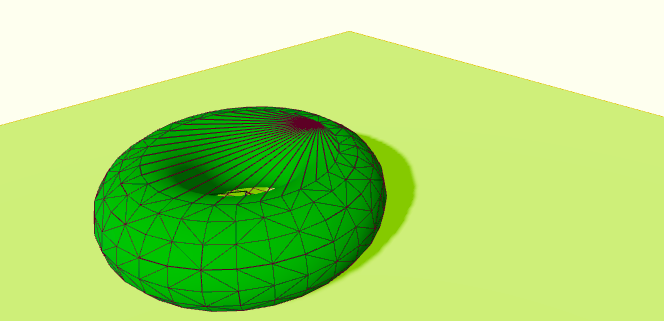<br>
Set "colliders" attibute of `<RigidBody>` to **"hull"**. <br>
It's like putting an elastic membrane around the object.

```
<RigidBody colliders="hull">
    <mesh .... />
</RigidBody>
```

### WPR-2-4. Trimesh collider

<br>
Set "colliders" attibute of `<RigidBody>` to **"trimesh"**. <br>
You should avoid using trimesh with dynamic **RigidBodies** (dynamic objects are the ones falling like the sphere and the torus). The reason is that colliders generated with a trimesh are empty on the inside and it makes collision detection more complicated and prone to bugs. A fast object might get through the trimesh or end up stuck on its surface. This doesn’t mean that you can’t use it, but, preferably, you should use it on fixed RigidBodies. Otherwise, you should expect some bugs.

```
<RigidBody colliders="trimesh">
    <mesh .... />
</RigidBody>
```

### WPR-2-5. Custom collider

First, we need to tell React Three Rapier not to generate the automatic collider by setting the "colliders" attribute to **"false"**. <br><br>

```
<RigidBody colliders={false}>
    <mesh .... />
</RigidBody>
```

#### WPR-2-5-0. Rapier collider documentation

Since React Three Rapier implements Rapier's colliders, we can use the Rapier documentation as a reference (Check the "Constructors" part). <br>

- [BallCollider](https://rapier.rs/javascript3d/classes/Ball.html)
- [CuboidCollider](https://rapier.rs/javascript3d/classes/Cuboid.html)
- [RoundCuboidCollider](https://rapier.rs/javascript3d/classes/RoundCuboid.html)
- [CapsuleCollider](https://rapier.rs/javascript3d/classes/Capsule.html)
- [ConeCollider](https://rapier.rs/javascript3d/classes/Cone.html)
- [CylinderCollider](https://rapier.rs/javascript3d/classes/Cylinder.html)
- [ConvexHullCollider](https://rapier.rs/javascript3d/classes/ConvexPolyhedron.html)
- [TrimeshCollider](https://rapier.rs/javascript3d/classes/TriMesh.html)
- [HeightfieldCollider](https://rapier.rs/javascript3d/classes/Heightfield.html)

#### WPR-2-5-1. CuboidCollider

<br>
If you want to put mesh inside CuboidCollider, then put `<mesh>` and `<CuboidCollider>` at the center and add move `<RigidBody>` by adding **"position"** and **"rotation"** attributes to it. <br>
Be aware, **"scale"** is not suppported by `<RigidBody>`!

```
import { CuboidCollider, .... } from "@react-three/rapier";

....

<RigidBody colliders={false} position={[0, 1, 0]} rotation={[Math.PI * 0.5, 0, 0]}>
    <CuboidCollider args={[1.5, 1.5, 0.5]} />

    <mesh castShadow>
        <torusGeometry args={[1, 0.5, 16, 32]} />
        <meshStandardMaterial color="violet" />
    </mesh>
</RigidBody>
```

#### WPR-2-5-2. Multiple colliders

<br>
You can create multiple colliders inside one `<RigidBody>`. <br>
To adjust each collider, you can do by adding **"position"** and **"rotation"** attributes. respectively.

```
<RigidBody
  colliders={false}
  position={[0, 1, 0]}
  rotation={[Math.PI * 0.5, 0, 0]}
>
    <CuboidCollider args={[1.5, 1.5, 0.5]} />

    <CuboidCollider
      args={[0.25, 1, 0.25]}
      position={[0, 0, 1]}
      rotation={[-Math.PI * 0.35, 0, 0]}
    />

    <mesh castShadow>
        <torusGeometry args={[1, 0.5, 16, 32]} />
        <meshStandardMaterial color="violet" />
    </mesh>
</RigidBody>
```

#### WPR-2-5-4. BallCollider

<br>

```
import { BallCollider, .... } from "@react-three/rapier";

....

<RigidBody colliders={false} position={[0, 1, 0]} rotation={[Math.PI * 0.5, 0, 0]}>
    <BallCollider args={[1.5]} />

    <mesh castShadow>
        <torusGeometry args={[1, 0.5, 16, 32]} />
        <meshStandardMaterial color="violet" />
    </mesh>
</RigidBody>
```

## WPR-3. Access the body and apply forces

### WPR-3-0. Create 'reference' for an object

Create ref of an object you want to apply forces and add it to `<RigidBody>` (not `<mesh>`!).

```
const cube = useRef();

....

<RigidBody ref={cube}>
    <mesh>
        <boxGeometry />
        <meshStandardMaterial />
    </mesh>
</RigidBody>
```

### WPR-3-1. Create a handler for an action (jump)

Create a handler and add it to `<mesh>` though **'onClick'** attribute.

```
const handleCubeJump = () => {
    console.log("jump");
  };

....

<RigidBody ref={cube} onClick={handleCubeJump}>
    <mesh>
        <boxGeometry />
        <meshStandardMaterial />
    </mesh>
</RigidBody>
```

### WPR-3-2. How to access the physical body?

Via reference, you can access 'Rapier' physical body (even the reference is link to `<mesh>`!). <br>
[@dimforge/rapier3d/RigidBody](https://rapier.rs/javascript3d/classes/RigidBody.html) <br>
<br>

### WPR-3-3. `addForce` vs `applyImpulse`

`addForce` is used to apply a force that lasts for a quite long time (like the wind).<br><br>
`applyImpulse` is used to apply a short force for a very short period of time (like for a projectile).

### WPR-3-4. Make a cube jump

<br>
`applyImpulse` needs a Vector 3 as a parameter (the direction of the impluse) and its length will be used as the strength. <br>
You don't need to create a Vector 3 class, just need to create an object with x, y, z properties.

```
const handleCubeJump = () => {
    cube.current.applyImpulse({ x: 0, y: 5, z: 0 });
  };
```

### WPR-3-5. Rotation via `addTorque` vs `applyTorqueImpluse`

`addTorque` is equivalent of `addForce`. <br>
`applyTorqueImpluse` is equivalent of `applyImplulse`.

### WPR-3-6. Make a cube rotate

<br>
In order to rotate a cube, use `applyTorqueImpulse`. Be ware of a rotation axis.

```
const handleCubeJump = () => {
    cube.current.applyImpulse({ x: 0, y: 5, z: 0 }, true);

    cube.current.applyTorqueImpulse({ x: 0, y: 1, z: 0 }, true);
  };
```

### WPR-3-7. Randomize cube rotation

```
const handleCubeJump = () => {
    cube.current.applyImpulse({ x: 0, y: 5, z: 0 }, true);

    cube.current.applyTorqueImpulse({
      x: Math.random() - 0.5,       // return -0.5 ~ 0.5
      y: Math.random() - 0.5,       // return -0.5 ~ 0.5
      z: Math.random() - 0.5,       // return -0.5 ~ 0.5
    }, true);
  };
```

## WPR-4. Explore object setting for more fun physcis gimicks

### WPR-4-0. What you can do?

You can control; <br>
<br>

- Gravity
- Restitution (the amount of respective kinetic energy lost in collision between two moving objects)
- Gravity
- Where objects are
- Where object are supposed to go
- And more ....

### WPR-4-1. Gravity

The gravity is set to simulate earth gravity (near -9.81).<br>
You can play with **gravity** attribute of `<Physics>`.

```
<Physics debug gravity={[0, -1.6, 0]}>
    <RigidBody>
        <mesh .... />
    </RigidBody>

    ....
</Physics>
```

#### WPR-4-1-0. Apply different gravity to each object

You can apply different gravity to each object respectively with **"gravityScale"** attribute of `<RigidBody>`.

```
<Physics debug gravity={[0, -9.81, 0]}>  // The world gravity

    <RigidBody gravityScale={1.7}>       // Individual gravity
        <mesh .... />
    </RigidBody>

    <RigidBody gravityScale={0.1}>       // Individual gravity
        <mesh .... />
    </RigidBody>

    ....
</Physics>
```

#### WPR-4-1-1. Change the gravity at run time

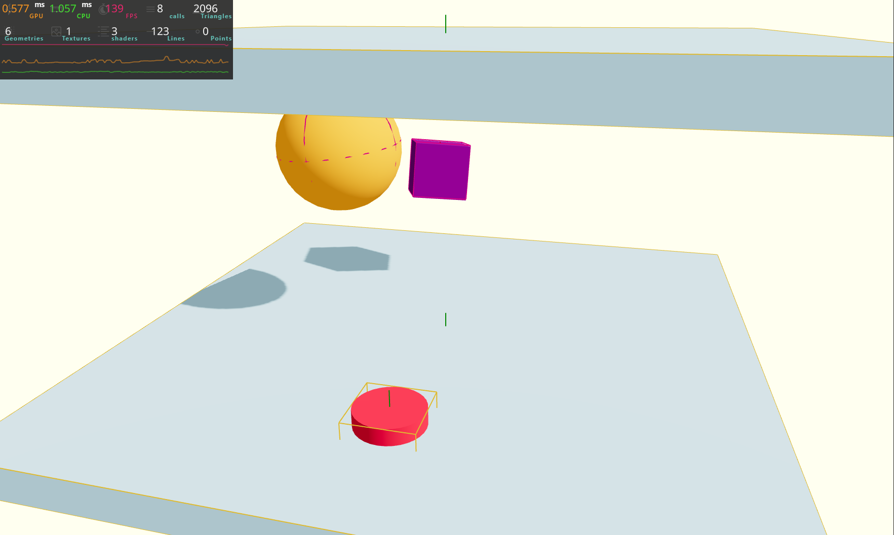<br>
Toggle reverse & normal gravity with the botton. <br>
In addition, wake up target meshes at the same time.

```
const [reveseGravityParam, setReverseGravityParam] = useState(1);

const handleReverseGravity = () => {
    setReverseGravityParam(
      (prevReveseGravityParam) => prevReveseGravityParam * -1
    );

    // Need to wake up sleeping objects
    sphere.current.wakeUp();
    cube.current.wakeUp();
  };

....

    <Physics debug gravity={[0, -9.81 * reveseGravityParam, 0]}>

        ....

        {/* REVERSE GRAVITY BUTTON */}
        <RigidBody ref={button} type="fixed">
          <mesh .... onClick={handleReverseGravity}>
            <cylinderGeometry />
            <meshStandardMaterial color="crimson" />
          </mesh>
        </RigidBody>

        ....
    </Physics>
```

### WPR-4-2. Restitution

You can control the bounciness with `restitution` attribute. <br>
The default value is `0`, meaning that it doesn't bounce at all. <br>

#### WPR-4-2-0. Apply restitution

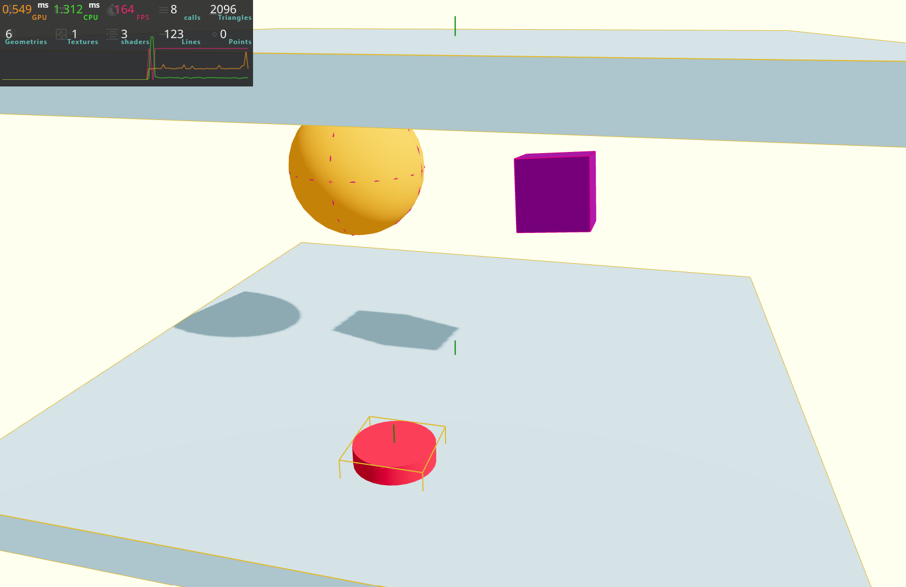<br>
If you want to make an object bouncy, you should also consider its contact floor. If you don't set restitution of the floor, it means the object falls onto some solid material plane such as metal or concrete. So if you want to make the object falling in a good bouncy way, you should set the floor restitution. If you set both restitutions of the falling object and the contact floor to `1`, it bounces 100%.

```
<RigidBody .... restitution={1}>     // A falling object
    <mesh .... />
</RigidBody>

<RigidBody .... restitution={1}>     // A contacting floor
    <mesh .... />
</RigidBody>
```

#### WPR-4-2-1. Change restitution rule

By default, Rapier will take an average of the two `restitution`. <br>
It's possible to change that rule, but it has to be done with the `Collider` itself, not the `RigidBody`. This means that first, you need to create `Collider` by yourself, and then import `CoefficientCombineRule` from Rapier and choose one of the rules provided in that object.

### WPR-4-3. Friction

Friction lets us decide how much the surface are supposed to rub off on each other. You can control it with the `friction` attribute and the default value is `0.7`(`0` is no friction, like on the ice).

#### WPR-4-3-0. Apply friction

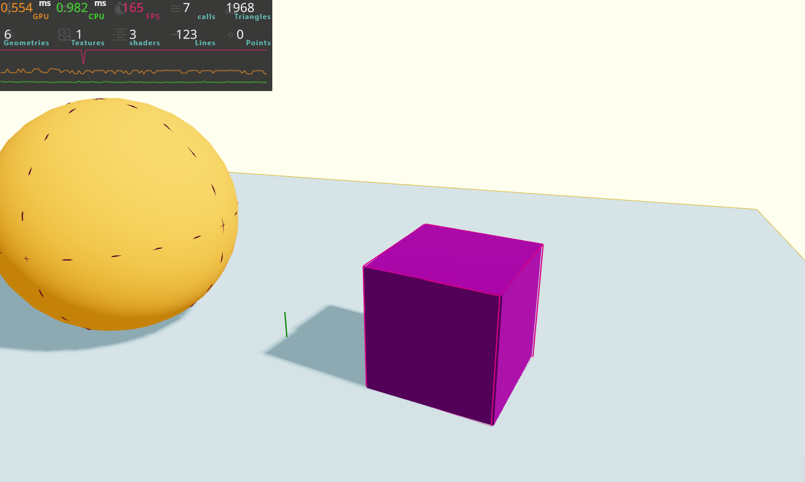<br>
If you want to make an object slide on the floor, you should also make sure that its contact floor has the same low friction param.

```
<RigidBody .... friction={0}>     // A sliding object
    <mesh .... />
</RigidBody>

<RigidBody .... friction={0}>     // A contacting floor
    <mesh .... />
</RigidBody>
```

### WPR-4-4. Mass

The mass of the `RigidBody` is automatically calculated as the sum of the masses of the `Colliders` that make up the `RigidBody`. The mass of the `Colliders` `is automatically calculated accordning to their shape and volume. <br>
In other words, big object will automatically have a bigger mass.<br><br>
The mass won't change how fast an object falls (which means all objects fall at the same speed if there's no air friction or other affecting stuff). However, the mass will influence the forces involved. If two objects collide while one has a huge mass and the other one has a small mass, the huge mass will push away the small mass. <br>

#### WPR-4-4-0. Change mass of objects


In order to tweak objects' mass, you need to create `Collider` by yourself. <br>
`1` is default, and if you set the lower value like `0.5`, it behaves as if it's made of cardboard, and if you set the higher value like `2`, it does of metal. Thus, the mass affects behaviours when forces are applied.

```
<RigidBody .... colliders={false}>
    <CuboidCollider mass={0.5} args={[0.5, 0.5, 0.5]} />

    <mesh castShadow onClick={handleCubeJump}>
        <boxGeometry />
        <meshStandardMaterial color="purple" />
    </mesh>
</RigidBody>
```

#### WPR-4-4-1. Change apply force / impluse flexibly depending on object mass


Since mass affects force appiled behaviours, maybe you need to take care the force strength. In that case, you can tweak like below to maintain the same behaviour regardless of mass.

```
// Handler - cube jump
const handleCubeJump = () => {
const mass = cube.current.mass();       // Accessing the mass of object

cube.current.applyImpulse({ x: 0, y: 5 * mass, z: 0 }, true);   // Here's trick
cube.current.applyTorqueImpulse(
    {
    x: Math.random() - 0.5,
    y: Math.random() - 0.5,
    z: Math.random() - 0.5,
    },
    true
);
};

....

    <RigidBody .... colliders={false}>
        <CuboidCollider mass={2} args={[0.5, 0.5, 0.5]} />

        <mesh castShadow onClick={handleCubeJump}>
            <boxGeometry />
            <meshStandardMaterial color="purple" />
        </mesh>
    </RigidBody>

```

### WPR-4-5. Position and rotation

We can change the position & rotatino of `<RigidBody>` through their `position` and `rotation` attributes. But for **"dynamic" and "fixed"** object, you SHOULD NOT CHANGE THOESE VALUES!! Thus, if you want to move an object, you should apply forces to it.<br><br>
If you really really need update the object position & rotation directly, there are below two options.

#### WPR-4-5-0. If you need to move it just once

You can do it with the appropriate methods, but you'll have to reset velocities that are currently applied on it and also make sure to not move it inside another `RigidBody`.

#### WPR-4-5-1. If you need to move it in time (like a carousel or moving obstacle)

You can use the `kinematic` types to make objects move & rotate and it's often used for character controllers and carousels. There's two types: `kinematicPosition` and `kinematicVelocity`.

#### WPR-4-5-2. `kinematicPosition` vs `kinematicVelocity`

`kinematicPosition`: you provide the next position and it'll update the object velocity accordingly.<br>
`kinematicVelocity`: you provide the velocity directly.

#### WPR-4-5-3. `kinematic` objects don't move by forces

Objects whose type are `kinematic` are not affected by forces and move. The only way to move them is using `kinematicPosition` or `kinematicVelocity` to change their positions.

#### WPR-4-5-4. `setNextKinematicTranslation` vs `setNextKinematicRotation`

`setNextKinematicTranslation` (Fn): move an object
`setNextKinematicRotation` (Fn): rotate an object

#### WPR-4-5-5. Rotate the twister

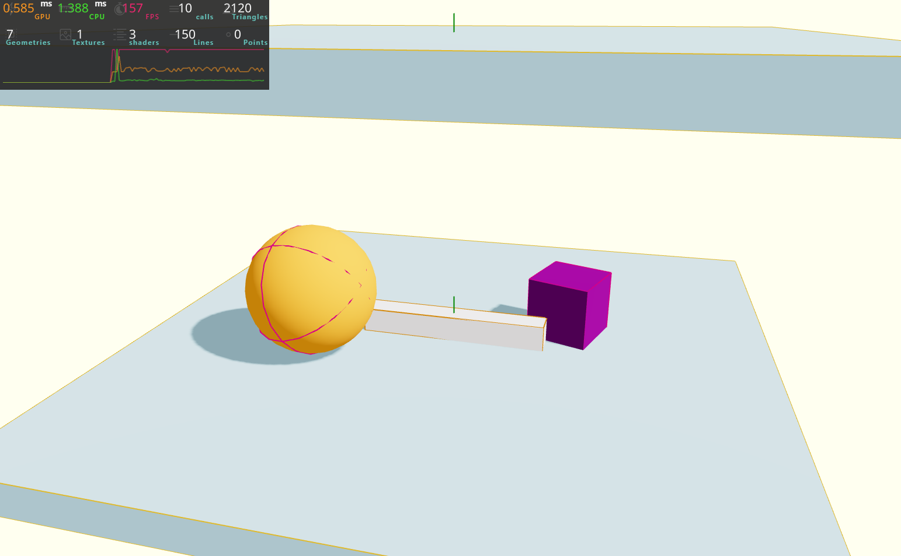
The function `setNextKinematicRotation` is expecting a Quaternion and not a Euler. Quaternion are harder to express and you cannot write just one directly. Therefore, you need to take several steps properly. <br><br>

0. Set the object type to `kinematicPosition`
1. Create a Three.js **"Euler"**
2. Create a Three.js **"Quaternion"**
3. Send that **"Quaternion"** to `setNextKinematicRotation`

<br><br>

```
const twister = useRef();

....

// Rotate the twister with each frame
useFrame((state, delta) => {
    const time = state.clock.getElapsedTime();

    const eulerRotation = new THREE.Euler(0, time, 0);
    const quaternionRotation = new THREE.Quaternion();
    quaternionRotation.setFromEuler(eulerRotation);

    twister.current.setNextKinematicRotation(quaternionRotation);
});

....

    {/* TWISTER */}
    <RigidBody .... type="kinematicPosition">
        <mesh .... />
    </RigidBody>

```

#### WPR-4-5-6. Move the twister position

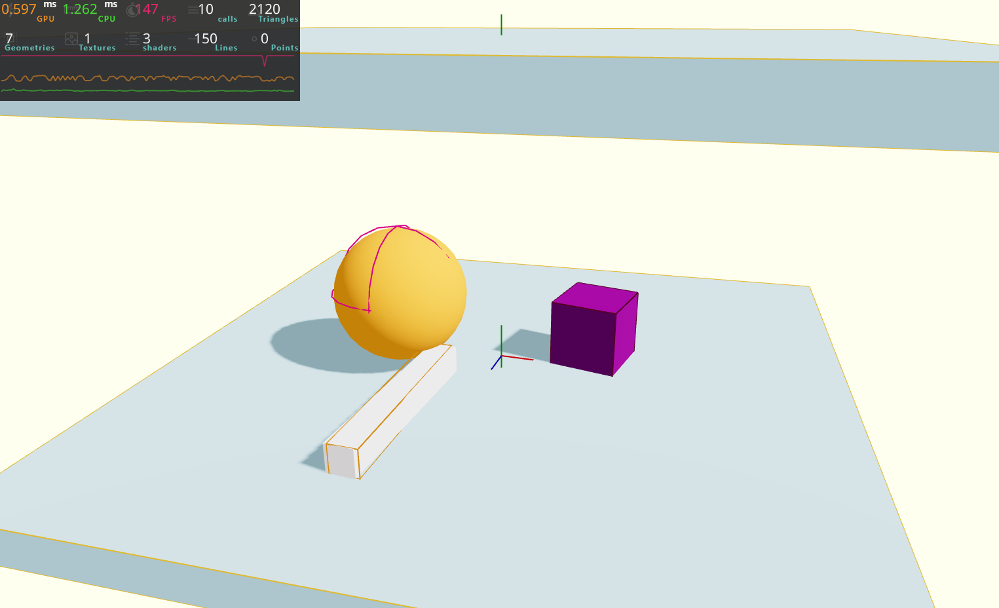

```
const twister = useRef();

....

// Rotate & move the twister with each frame
useFrame((state, delta) => {
    // Fetch time
    const time = state.clock.getElapsedTime();

    // For rotating the twister
    const eulerRotation = new THREE.Euler(0, time, 0);
    const quaternionRotation = new THREE.Quaternion();
    quaternionRotation.setFromEuler(eulerRotation);

    twister.current.setNextKinematicRotation(quaternionRotation);

    // For moving positions of the twister
    const angle = time * 0.5;

    const x = Math.cos(angle) * 2;
    const z = Math.sin(angle) * 2;

    twister.current.setNextKinematicTranslation({x: x, y: -0.8, z: z})

});

....

    {/* TWISTER */}
    <RigidBody .... type="kinematicPosition">
        <mesh .... />
    </RigidBody>
```

### WPR-4-6. Event

We can listen to events by adding attributes directly on the `<RigidBody>`. <br><br>

(cf. `onClick()` event ---> `<mesh>`, `ref` ---> `<RigidBody>`)

#### WPR-4-6-0. Four different events

- `onCollisionEnter`: when the `RigidBody` hit something
- `onCollisionExit`: when the `RigidBody` separates from the object it just hit
- `onSleep`: when the `RigidBody` starts sleeping
- `onWake`: when the `RigidBody` stops sleeping

#### WPR-4-6-1. Sleeping and wake up (only `dynamic` type, not `fix` & `kinematic` types)

When a dynamic rigid-body doesn't move (or moves very slowly) during **a few seconds**, it will be **marked as sleeping** by the physics pipeline. Rigid-bodies marked as sleeping are no longer simulated by the physics engine until they are woken up. That way the physics engine doesn't waste any computational resources simulating objects that don't actually move. They are woken up automatically whenever another non-sleeping rigid-body starts interacting with them (either with a joint, or with one of its attached colliders generating contacts).

#### WPR-4-6-2. `onSleep` and `onWake` events

You can add `onSleep` and `onWake` events to `<RigidBody>` to trigger some functions.

```
<RigidBody
    ....
    onSleep={() => { console.log("Sphere: sleep"); }}
    onWake={() => { console.log("Sphere: wake up"); }}
>
    <mesh ... />
</RigidBody>
```

#### WPR-4-6-3. `onCollisionEnter` events

You can add the `onCollisionEnter` event to `<RigidBody>` to trigger some functions.

```
<RigidBody
    ....
    onCollisionEnter={() => { console.log("Cube: collision!"); }}
>
    <mesh ... />
</RigidBody>
```

#### WPR-4-6-4. Sounds for collision happening with `Audio` class

In order to instantiate the audio only once in case the component is being re-rendered, call `useState()` at the begining of the `Experience` component and send it a function which will return an instance of `Audio` class.<br><br>

Most browsers will prevent you from playing sounds if the user hasn't interacted with the page first, so you need to click or do something on the screen before the sound plays.

```
  /**
   * Sate - import a sound
   */
  const [hitSound] = useState(() => {
    return new Audio("./sounds/hit.mp3");
  });

  /**
   * Function - collision sounds
   */
  const collisionEnter = () => {
    hitSound.currentTime = 0; // Set time position to 0 seconds
    hitSound.volume = Math.random(); // Randomize sound volume
    hitSound.play();
  };

  ....

    <RigidBody .... onCollisionEnter={collisionEnter}>
        <mesh ... />
    </RigidBody>
```

#### WPR-4-6-5. Sounds for collision happening with `use-sound`

- [use-sound Github](https://github.com/joshwcomeau/use-sound?tab=readme-ov-file)
- [use-sound tutorials](https://www.joshwcomeau.com/react/announcing-use-sound-react-hook/)
- [use-sound quick examples](https://use-sound.netlify.app/?path=/story/usesound--simple)
- [freesound](https://freesound.org/) <br><br>

```
import useSound from 'use-sound';
import hitSound from '../../public/sounds/hit.mp3';

....

const [playHitSound] = useSound(hitSound);

....

    <RigidBody .... onCollisionEnter={playHitSound}>
        <mesh ... />
    </RigidBody>
```

## WPR-5. Stress test - falling hundreds objects

### WPR-5-0. Instanced mesh

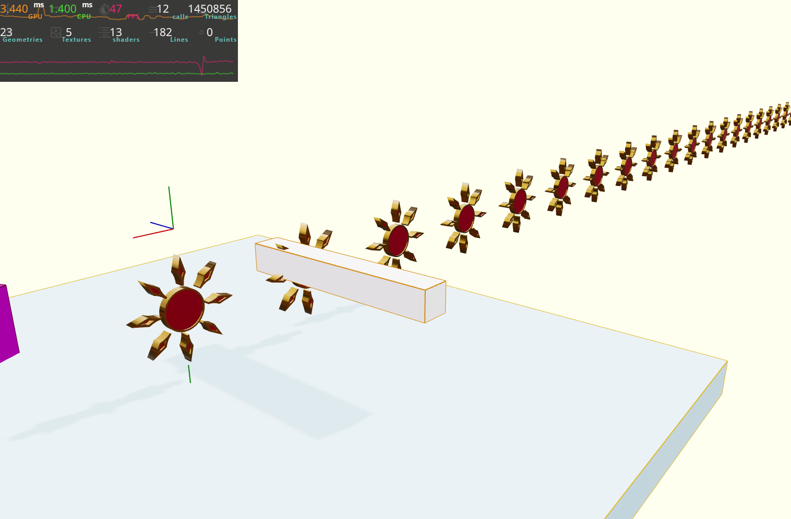
**References** <br>

- [three.js InstancedMesh](https://threejs.org/docs/#api/en/objects/InstancedMesh)
- [Bruno Simons 20k challenge](https://codesandbox.io/p/sandbox/bruno-simons-20k-challenge-2qfxj4)
- [Floating instanced shoes](https://codesandbox.io/p/sandbox/floating-instanced-shoes-h8o2d?file=%2Fsrc%2Findex.js) <br><br>

In order to implement `instancedMesh`, you need to provide three arguments; `geometry`, `material` and the number of instances. <br><br>

And also you need to provide a `Matrix4` for each instance and you can do through a reference with `useRef()`. For providing the matrices on the first render, you can do with `useEffect()`.<br><br>

`Matrix4` is a combination of position, rotation, and scale. They are used to move the vertices according to the object transformation. When we change the `position`, `rotation` or `scale` of an object, Three.js will calculate the `Matrix4` automatically before rendering it.<br><br>

There are many different methods available on `Matrix4` and one of them is `compose`, to which you need to send a position (`Vector3`), a rotation (`Quaternion`) and a scale (`Vector3`).<br><br>

**compose ( position : Vector3, quaternion : Quaternion, scale : Vector3 )** <br><br>

[Three.js "Matrix4" documentation link](https://threejs.org/docs/?q=matrix#api/en/math/Matrix4) <br><br>

```
import { Geometry, Base, Addition } from "@react-three/csg";

....

    /**
    * Import models
    */
    const clear = useGLTF("/models/weather-icons/clear.glb");
    console.log(clear);

    /**
    * Objects ref and count
    */
    const objects = useRef();
    const objectsCount = 100;

    /**
    * Provide matrices for hundreds of objects
    */
    useEffect(() => {
    for (let i = 0; i < objectsCount; i++) {
        const matrix = new THREE.Matrix4();

        matrix.compose(
        new THREE.Vector3(i * 2, 0, 0),
        new THREE.Quaternion(),
        new THREE.Vector3(1, 1, 1)
        );

        objects.current.setMatrixAt(i, matrix);
    }
    }, []);

    ....

        {/* HUNDREDS OF OBJECTS */}
        <instancedMesh
            castShadow
            ref={objects}
            args={[undefined, undefined, objectsCount]}
        >
            <Geometry useGroups>
                <Base
                    scale={0.15}
                    geometry={clear.nodes.Curve052.geometry}
                    material={clear.materials.clearMaterial}
                />
                <Addition
                    scale={0.15}
                    geometry={clear.nodes.Curve052_1.geometry}
                    material={clear.materials.edgeMaterial}
                />
            </Geometry>
        </instancedMesh>
```

### WPR-5-1. Apply physics to instanced mesh

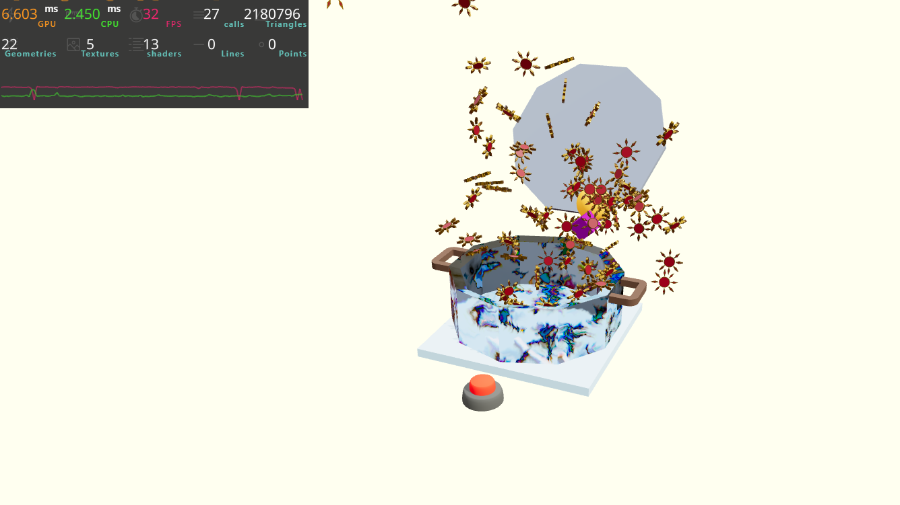
You need to wrap `<instancedMesh>` with `<instancedMeshRigidBodies>`. <br>

```
<InstancedRigidBodies>
    <instancedMesh castShadow args={[undefined, undefined, objectsCount]}>
    <Geometry useGroups>
        <Base
        scale={0.15}
        geometry={clear.nodes.Curve052.geometry}
        material={clear.materials.clearMaterial}
        />
        <Addition
        scale={0.15}
        geometry={clear.nodes.Curve052_1.geometry}
        material={clear.materials.edgeMaterial}
        />
    </Geometry>
    </instancedMesh>
</InstancedRigidBodies>
```

<br><br>

`<instancedMeshRigidBodies>` will take care of creating and sending the matrices to `<instancedMesh>`, thus you can get rid of `ref={objects}` and `useEffect()`. <br><br>

You need to create an array and put an object inside for each instance. This has to be done only once and the value has to be kept if the component rerenders. Thus, use `useMemo()`. Then after creating the array, you need to send it to `<instancedRigidBody>` as the `instance` attribute. <br>

```
/**
* Object instances' count & matrices
*/
const objectsCount = 100;
const instances = useMemo(() => {
const instances = [];

for (let i = 0; i < objectsCount; i++) {
    instances.push({
    key: "instance_" + i,
    position: [
        (Math.random() - 0.5) * 8,
        6 + i * 0.2,
        (Math.random() - 0.5) * 8
    ],
    rotation: [
        Math.random(),
        Math.random(),
        Math.random()
    ],
    });
}

return instances;
}, []);

....

    {/* HUNDREDS OF OBJECTS */}
    <InstancedRigidBodies instances={instances}>
        <instancedMesh castShadow args={[undefined, undefined, objectsCount]}>
        <Geometry useGroups>
            <Base
            scale={0.15}
            geometry={clear.nodes.Curve052.geometry}
            material={clear.materials.clearMaterial}
            />
            <Addition
            scale={0.15}
            geometry={clear.nodes.Curve052_1.geometry}
            material={clear.materials.edgeMaterial}
            />
        </Geometry>
        </instancedMesh>
    </InstancedRigidBodies>
```

<br><br>

# Crate the marble race game

## CMR-0. An overview sketch

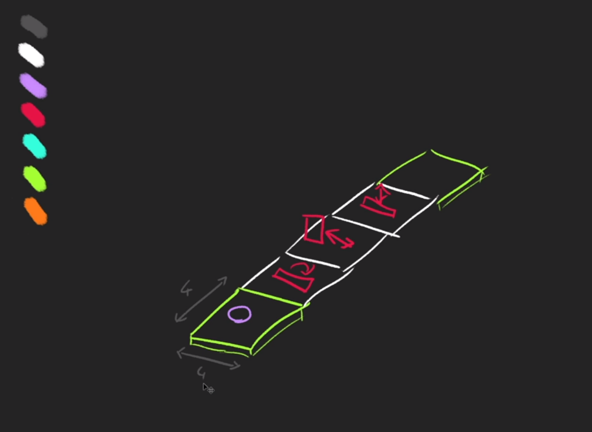 <br>

## CMR-1. Links

### CMR-1-0. Three.js Documentation

- [BoxGeometry](https://threejs.org/docs/#api/en/geometries/BoxGeometry)
- [MeshStandardMaterial](https://threejs.org/docs/#api/en/materials/MeshStandardMaterial)

## CMR-2. Levels

### CMR-2-0. Start block

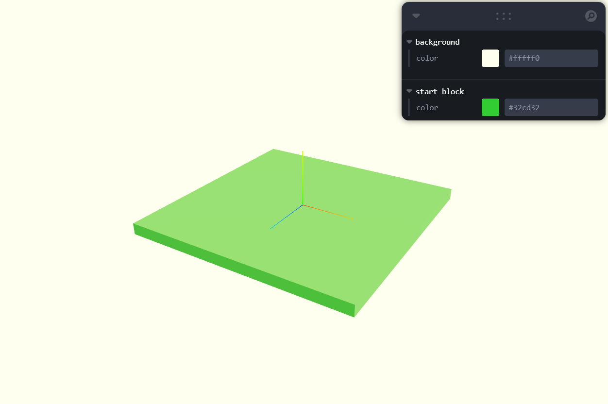<br>

For better performance, create a generic cube geometry and let it shared in multiple components. As for material, activate GUI.

```
/**
 * GENERIC CUBE GEOMETRY
 */
const boxGeometry = new THREE.BoxGeometry(1, 1, 1);

....

function BlockStart({ position = [0, 0, 0] }) {
  const { color } = useControls("start block", {
    color: "limegreen",
  });

  return (
    <group position={position}>
      <mesh
        geometry={boxGeometry}
        material={new THREE.MeshStandardMaterial({ color: color })}
        position={[0, -0.1, 0]}
        scale={[4, 0.2, 4]}
        receiveShadow
      />
    </group>
  );
}
```

### CMR-2-1. Spinner trap block

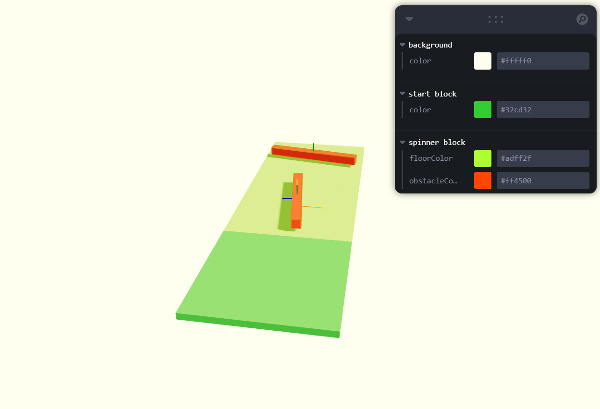<br>

In case multiple spinner blocks get populated, randomize its rotating speed and direction with useState(). <br><br>

- **Speed**: random param ranged 0.2 ~ 1.2
- **Direction**: 0.5 is threshold of clockwise / counterclockwise <br><br>

```
function BlockSpinner({ position = [0, 0, 0] }) {
  // Ref - spinner
  const obstacle = useRef();

  // State - spinner speed (randomize speed of multiple spinners)
  const [speed] = useState(
    () => (Math.random() + 0.2) * (Math.random() <= 0.5 ? -1 : 1)
  );

  // GUI
  const { floorColor, obstacleColor } = useControls("spinner block", {
    floorColor: "greenyellow",
    obstacleColor: "orangered",
  });

  // Rotate the spinner
  useFrame((state, delta) => {
    const time = state.clock.getElapsedTime();

    const euler = new THREE.Euler(0, time * speed, 0);
    const quaternion = new THREE.Quaternion();
    quaternion.setFromEuler(euler);

    obstacle.current.setNextKinematicRotation(quaternion);
  });

  return (
    <group position={position}>
      {/* FLOOR */}
      <mesh
        geometry={boxGeometry}
        material={new THREE.MeshStandardMaterial({ color: floorColor })}
        position={[0, -0.1, 0]}
        scale={[4, 0.2, 4]}
        receiveShadow
      />

      {/* SPINNER */}
      <RigidBody
        ref={obstacle}
        type="kinematicPosition"
        position={[0, 0.3, 0]}
        restitution={0.2}
        friction={0}
      >
        <mesh
          geometry={boxGeometry}
          material={new THREE.MeshStandardMaterial({ color: obstacleColor })}
          scale={[3.5, 0.3, 0.3]}
          castShadow
        />
      </RigidBody>
    </group>
  );
}
```

### CMR-2-2. Limbo trap block

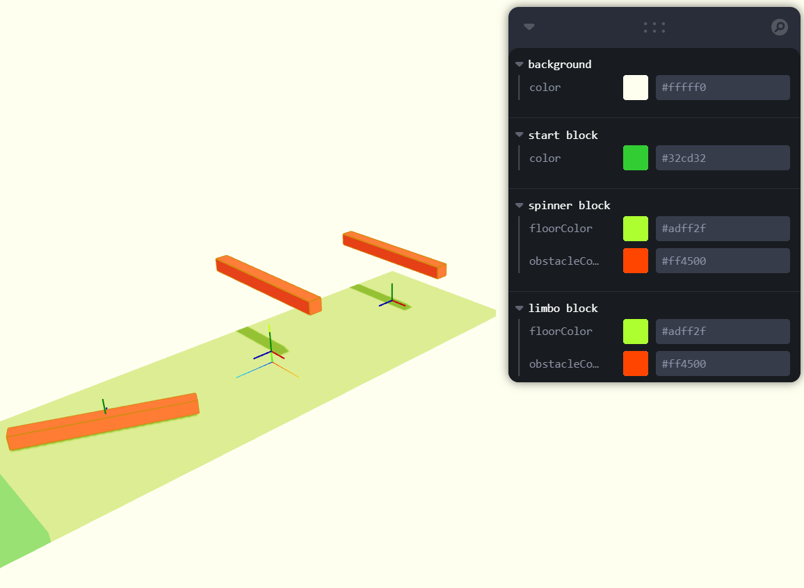<br>

In case multiple limbo blocks get populated, randomize its starting position (its speed is the same) and also take care of relative translation (`setNextKinematicTranslation`) <br><br>

- **Vertical move**: `y` ranged 0.15 ~ 2.15
- **Starting position time offset**: ranged 0 ~ Math.PI \* 2 (due to `sin()` principle)<br><br>

```
function BlockLimbo({ position = [0, 0, 0] }) {
  // Ref - limbo
  const obstacle = useRef();

  // State - limbo time offset (differentiate its start position)
  const [timeOffset] = useState(() => Math.random() * Math.PI * 2);

  // GUI
  const { floorColor, obstacleColor } = useControls("limbo block", {
    floorColor: "greenyellow",
    obstacleColor: "orangered",
  });

  // Make the limbo obstacle move vertically
  useFrame((state, delta) => {
    const time = state.clock.getElapsedTime();

    const y = Math.sin(time + timeOffset) + 1.15;

    obstacle.current.setNextKinematicTranslation({
      x: position[0],
      y: position[1] + y,
      z: position[2],
    });
  });

  return (
    <group position={position}>
      {/* FLOOR */}
      <mesh
        geometry={boxGeometry}
        material={new THREE.MeshStandardMaterial({ color: floorColor })}
        position={[0, -0.1, 0]}
        scale={[4, 0.2, 4]}
        receiveShadow
      />

      {/* LIMBO */}
      <RigidBody
        ref={obstacle}
        type="kinematicPosition"
        position={[0, 0.3, 0]}
        restitution={0.2}
        friction={0}
      >
        <mesh
          geometry={boxGeometry}
          material={new THREE.MeshStandardMaterial({ color: obstacleColor })}
          scale={[3.5, 0.3, 0.3]}
          castShadow
        />
      </RigidBody>
    </group>
  );
}
```

### CMR-2-3. Axe trap block

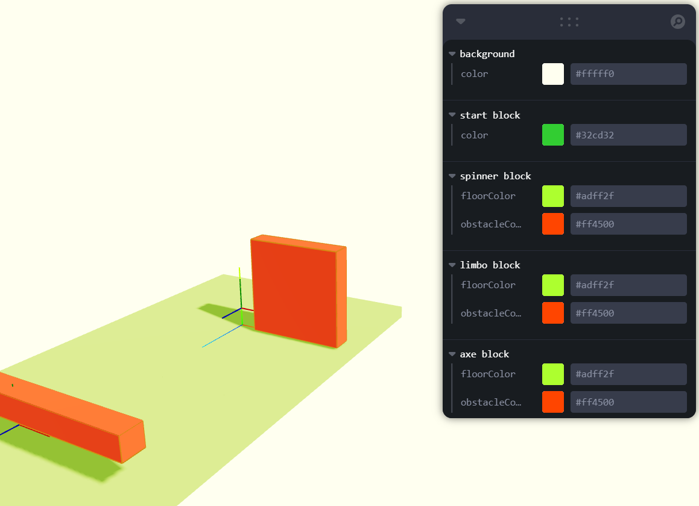<br>

In case multiple limbo blocks get populated, randomize its starting position (its speed is the same) and also take care of relative translation (`setNextKinematicTranslation`) <br><br>

- **Horizontal move**: `x` ranged -1.25 ~ 1.25
- **Starting position time offset**: ranged 0 ~ Math.PI \* 2 (due to `sin()` principle)<br><br>

```
function BlockAxe({ position = [0, 0, 0] }) {
  // Ref - axe
  const obstacle = useRef();

  // State - axe time offset (differentiate its start position)
  const [timeOffset] = useState(() => Math.random() * Math.PI * 2);

  // GUI
  const { floorColor, obstacleColor } = useControls("axe block", {
    floorColor: "greenyellow",
    obstacleColor: "orangered",
  });

  // Make the axe obstacle move horizontally
  useFrame((state, delta) => {
    const time = state.clock.getElapsedTime();

    const x = Math.sin(time + timeOffset) * 1.25;

    // Relative translation, instead of absolute translation
    obstacle.current.setNextKinematicTranslation({
      x: position[0] + x,
      y: position[1] + 0.8,
      z: position[2],
    });
  });

  return (
    <group position={position}>
      {/* FLOOR */}
      <mesh
        geometry={boxGeometry}
        material={new THREE.MeshStandardMaterial({ color: floorColor })}
        position={[0, -0.1, 0]}
        scale={[4, 0.2, 4]}
        receiveShadow
      />

      {/* AXE */}
      <RigidBody
        ref={obstacle}
        type="kinematicPosition"
        position={[0, 0.3, 0]}
        restitution={0.2}
        friction={0}
      >
        <mesh
          geometry={boxGeometry}
          material={new THREE.MeshStandardMaterial({ color: obstacleColor })}
          scale={[1.5, 1.5, 0.3]}
          castShadow
        />
      </RigidBody>
    </group>
  );
}
```

### CMR-2-4. End block

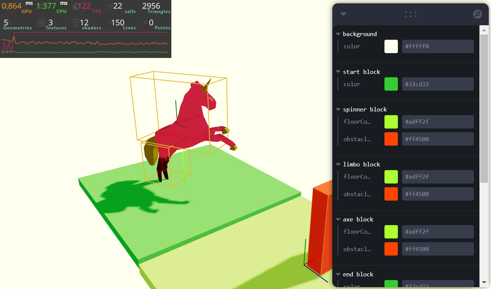<br>

Import the unicorn component.

```
function BlockEnd({ position = [0, 0, 0] }) {
  // GUI
  const { color } = useControls("end block", {
    color: "limegreen",
  });

  return (
    <group position={position}>
      <mesh
        geometry={boxGeometry}
        material={new THREE.MeshStandardMaterial({ color: color })}
        position={[0, 0, 0]}
        scale={[4, 0.2, 4]}
        receiveShadow
      />
      <RigidBody type="fixed" colliders={false}>
        <group rotation={[0, Math.PI * 0.15, 0]}>
          <CuboidCollider args={[0.4, 0.75, 1]} position={[0, 2, 0]} />
          <CuboidCollider args={[0.4, 0.5, 0.4]} position={[0, 0.7, -0.5]} />
        </group>
        <Unicorn />
      </RigidBody>
    </group>
  );
}
```

### CMR-2-5. Automatically shuffle the blocks
<br>

```
export function Level({
  count = 5,
  types = [BlockSpinner, BlockAxe, BlockLimbo], // React Component Functions
}) {
  const blocks = useMemo(() => {
    const blocks = [];

    for (let i = 0; i < count; i++) {
      const typeIndex = Math.floor(Math.random() * types.length);
      const type = types[typeIndex];
      blocks.push(type);
    }

    return blocks;
  }, [count, types]);

  return (
    <>
      <BlockStart position={[0, 0, 0]} />

      {blocks.map((Block, index) => (
        <Block key={index} position={[0, 0, -(index + 1) * 4]} />
      ))}

      <BlockEnd position={[0, 0, -(count + 1) * 4]} />
    </>
  );
}
```

### CMR-2-6. Bounds
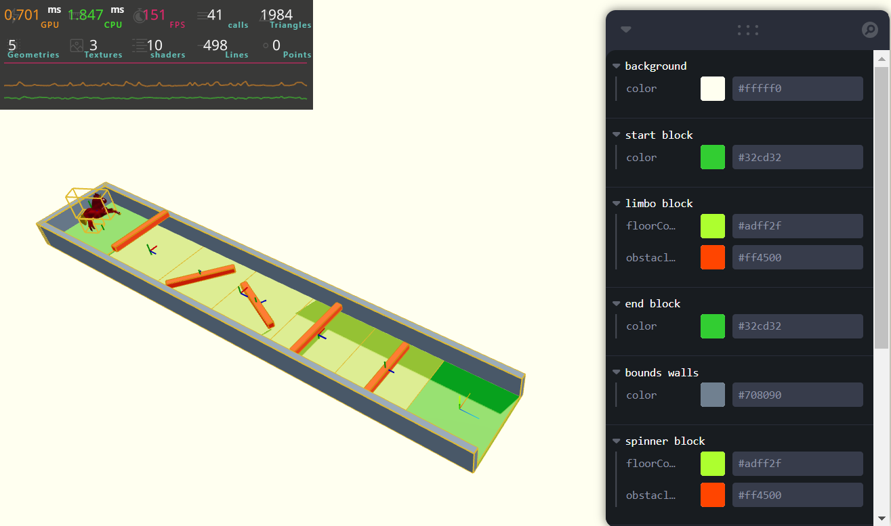<br>
```
function Bounds({ length = 1 }) {
  const { color } = useControls("bounds walls", {
    color: "slategrey",
  });

  return (
    <>
      <RigidBody type="fixed" restitution={0.2} friction={0}>
        {/* RIGHT WALL */}
        <mesh
          geometry={boxGeometry}
          material={new THREE.MeshStandardMaterial({ color: color })}
          position={[2 + 0.15, 0.75 - 0.2, -((length - 1) * 4) / 2]}
          scale={[0.3, 1.5, length * 4]}
          castShadow
        />

        {/* LEFT WALL */}
        <mesh
          geometry={boxGeometry}
          material={new THREE.MeshStandardMaterial({ color: color })}
          position={[-(2 + 0.15), 0.75 - 0.2, -((length - 1) * 4) / 2]}
          scale={[0.3, 1.5, length * 4]}
          receiveShadow
        />
        {/* BACK WALL */}
        <mesh
          geometry={boxGeometry}
          material={new THREE.MeshStandardMaterial({ color: color })}
          position={[0, 0.75 - 0.2, -((length - 1) * 4 + 2)]}
          scale={[4 + 0.3 * 2, 1.5, 0.3]}
          receiveShadow
        />
      </RigidBody>
    </>
  );
}
```
### CMR-2-7. Set floor restitution and friction
Set `friction` of `<RigidBody>` of floors to `1` otherwise a ball won't move when it rotates. <br>

```
/**
 * Floor params
 */
const floorRestitution = 0.2;
const floorFriction = 1;

....

export function BlockStart({ .... }){
    ....

    <RigidBody
        type="fixed"
        restitution={floorRestitution}
        friction={floorFriction}
    >

        ....

    </RigidBody>

    ....

}

export function BlockSpinner({ .... }){
    ....

    <RigidBody
        type="fixed"
        restitution={floorRestitution}
        friction={floorFriction}
    >

        ....

    </RigidBody>

    ....

}

export function BlockLimbo({ .... }){
    ....

    <RigidBody
        type="fixed"
        restitution={floorRestitution}
        friction={floorFriction}
    >

        ....

    </RigidBody>

    ....

}

export function BlockAxe({ .... }){
    ....

    <RigidBody
        type="fixed"
        restitution={floorRestitution}
        friction={floorFriction}
    >

        ....

    </RigidBody>

    ....

}

export function BlockEnd({ .... }){
    ....

    <RigidBody
        type="fixed"
        restitution={floorRestitution}
        friction={floorFriction}
    >

        ....

    </RigidBody>

    ....

}
```

## CMR-3. Player

### CMR-3-1. Create a player component
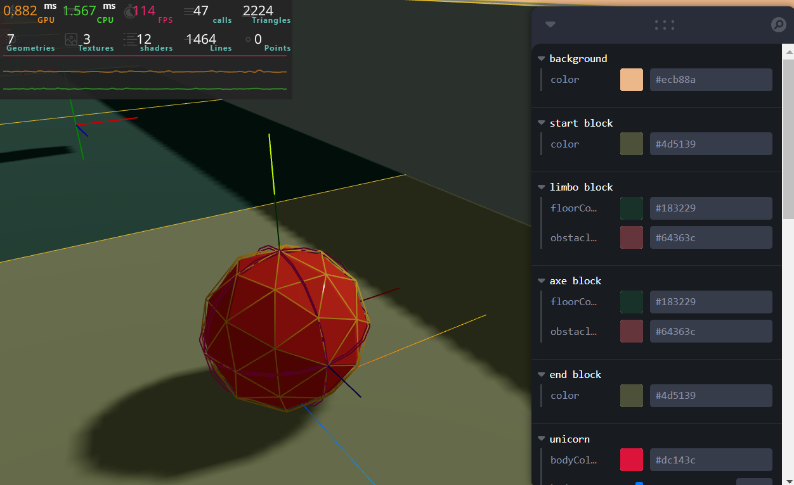

- [IcosahedronGeometry](https://threejs.org/docs/#api/en/geometries/IcosahedronGeometry)<br><br>

For make the player marble ball realistic, add some bounciness (`restitution={0.2}`) and 100% friction (`friction={1}`). <br>
```
export default function MarbleBallPlayer() {
  /**
   * OUTER FRAME MATERIAL
   */
  const {
    flatShadingOuter,
    colorOuter,
    metalnessOuter,
    roughnessOuter,
    wireframeOuter,
  } = useControls("marble ball - outer frame", {
    flatShadingOuter: false,
    colorOuter: "#8d6a1a",
    metalnessOuter: {
      value: 0.2,
      min: 0,
      max: 1,
      step: 0.01,
    },
    roughnessOuter: {
      value: 0.1,
      min: 0,
      max: 1,
      step: 0.01,
    },
    wireframeOuter: true,
  });

  /**
   * INNER SPHERE MATERIAL
   */
  const {
    flatShadingInner,
    colorInner,
    metalnessInner,
    roughnessInner,
    wireframeInner,
  } = useControls("marble ball - inner sphere", {
    flatShadingInner: true,
    colorInner: "#8c2c19",
    metalnessInner: {
      value: 0.2,
      min: 0,
      max: 1,
      step: 0.01,
    },
    roughnessInner: {
      value: 0.1,
      min: 0,
      max: 1,
      step: 0.01,
    },
    wireframeInner: false,
  });

  return (
    <RigidBody
      colliders="ball"
      position={[0, 1, 0]}
      restitution={0.2}
      friction={1}
    >
      {/* OUTER FRAME */}
      <mesh castShadow>
        <icosahedronGeometry args={[0.3, 1]} />
        <meshStandardMaterial
          flatShading={flatShadingOuter}
          color={colorOuter}
          metalness={metalnessOuter}
          roughness={roughnessOuter}
          wireframe={wireframeOuter}
        />
      </mesh>

      {/* INNER SPHERE */}
      <mesh castShadow>
        <icosahedronGeometry args={[0.29, 1]} />
        <meshStandardMaterial
          flatShading={flatShadingInner}
          color={colorInner}
          metalness={metalnessInner}
          roughness={roughnessInner}
          wireframe={wireframeInner}
        />
      </mesh>
    </RigidBody>
  );
}
```